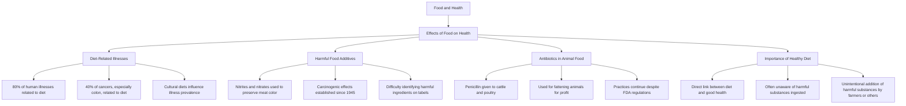

# Model Paper(From Textbook)

## Section A 

### A) Summarise any one of the passages given below, give a suitable title and underline the topic sentence (10 Marks)
Electric trolley cars or trams were once the chief mode of public transportation in the
United States. Though they required tracks and electric cables to run, these trolley cars
were clean and comfortable. In 1922, auto manufacturer General Motors created a special
unit to replace electric trolleys with cars, trucks, and buses. Over the next decade, this
group successfully lobbied for laws and regulations that made operating trams more
difficult and less profitable. In 1936 General Motors created several front companies for
the purpose of purchasing and dismantling the trolley car system. They received
substantial investments from Firestone Tire, Standard Oil of California, Phillips
Petroleum, and other parties invested in the automotive industry. Some people suspect
that these parties wanted to replace trolley cars with buses to make public transportation
less desirable, which would then increase automobile sales. The decline of the tram
system in North America could be attributed to many things—labor strikes, the Great
Depression, regulations that were unfavourable to operators—but perhaps the primary
cause was having a group of powerful men from rival sectors of the auto industry working
together to ensure its destruction.

### Title: The Decline of Electric Trolley Cars in America
- Electric trolley cars or trams were once the chief mode of public transportation in the United States. These trolley cars, which required tracks and electric cables, were known for being clean and comfortable. However, in 1922, General Motors established a unit aimed at replacing electric trolleys with cars, trucks, and buses. Over the following decade, this group successfully lobbied for laws and regulations that made tram operations increasingly difficult and less profitable. By 1936, General Motors had created several front companies to purchase and dismantle the trolley car system, receiving significant investments from companies like Firestone Tire and Standard Oil. There are suspicions that these parties aimed to replace trolley cars with buses to make public transportation less appealing, thereby boosting automobile sales. While the decline of the tram system can be linked to various factors such as labor strikes and the Great Depression, the primary cause was likely the coordinated efforts of influential figures in the automotive industry to ensure its downfall.

OR

In the Southwest during early half of the 1800s, cows were only worth 2 or 3 dollars
apiece. They roamed wild, grazed off of the open range, and were abundant. Midway
through the century though, railroads were built and the nation was connected. People
could suddenly ship cows in freight trains to the Northeast, where the Yankees had a
growing taste for beef. Out of the blue, the same cows that were once worth a couple of
bucks were now worth between twenty and forty dollars each, if you could get them to the
train station. It became pretty lucrative to wrangle up a drove of cattle and herd them to
the nearest train town, but it was at least as dangerous as it was profitable. Cowboys were
threatened at every turn. They faced cattle rustlers, stampedes and extreme weather, but
kept pushing those steers to the train station. By the turn of the century, barbed wire killed
the open range and some may say the cowboy too, but it was the train that birthed him.

### Title: The Impact of Railroads on Cattle Ranching in the 1800s
- In the Southwest during the early half of the 1800s, cows were only worth 2 or 3 dollars apiece. Initially, cows roamed wild and grazed freely on the open range, making them abundant. However, the construction of railroads midway through the century transformed the cattle industry by connecting the nation. This development allowed for the shipment of cattle via freight trains to the Northeast, where demand for beef was increasing. Consequently, cows that were once valued at a few dollars could now be sold for between twenty and forty dollars each, provided they reached the train station. This shift made it profitable to round up cattle and herd them to train towns, although it was fraught with danger. Cowboys faced numerous threats, including cattle rustlers, stampedes, and harsh weather conditions, yet they persevered in driving the cattle to the train stations. By the turn of the century, the introduction of barbed wire ended the open range, which some argue also marked the decline of the cowboy, but it was the railroad that ultimately gave rise to the cowboy era.

### B) Make Notes for any one of the passages given below giving a suitable title using linear or diagram method(10 Marks)
The work of the heart can never be interrupted. The heart’s job is to keep oxygen rich
blood, flowing through the body. All the body’s cells need a constant supply of Oxygen,
especially those in the brain. The brain cells like only four to five minutes after their
oxygen is cut off, and death comes to th entire body.
The heart is a specialized muscle that serves as a pump. This pump is divided into four
chambers connected by tiny doors called valves. The chambers work to keep the blood
flowing round the body in a circle.
At the end of each circuit, veins carry the blood to the right atrium, the first of the four
chambers 2/5 oxygen by then is used up and it is on its way back to the lung to pick up a
fresh supply and to give up the carbon dioxide it has accumulated. From the right atrium
the blood flows through the tricuspid valve into the second chamber, the right ventricle.
The right ventricle contracts when it is filled, pushing the blood through the pulmonary
artery, which leads to the lungs – in the lungs the blood gives up its carbon dioxide and
picks up fresh oxygen. Then it travels to the third chamber the left atrium. When this
chamber is filled it forces the blood through the valve to the left ventricle. From here it is
pushed into a big blood vessel called aorta and sent round the body by way of arteries.
Heart disease can result from any damage to the heart muscle, the valves or the
Pacemaker. If the muscle is damaged, the heart is unable to pump properly. If the valves
are damaged blood cannot flow normally and easily from one chamber to another, and if
the pacemaker is defective, the contractions of the chambers will become un-coordinated.
Until the twentieth century, few doctors dared to touch the heart. In 1953 all this changed
after twenty years of work, Dr. John Gibbon in the USA had developed a machine that
could take over temporarily from the heart and lungs. Blood could be routed through the
machine bypassing the heart so that surgeons could work inside it and see what they were
doing. The era of open heart surgery had begun.
In the operating theatre, it gives surgeons the chance to repair or replace a defective heart.
Many parties have had plastic valves inserted in their hearts when their own was faulty.
Many people are being kept alive with tiny battery operated pacemakers; none of these
repairs could have been made without the heart – lung machine. But valuable as it is to the
surgeons, the heart lung machine has certain limitations. It can be used only for a few
hours at a time because its pumping gradually damages the bloods cells.
### **Title: The Function and Importance of the Heart**

1. **Heart Function**
   - Continuous operation is essential.
   - Keeps oxygen-rich blood flowing throughout the body.
   - All cells, especially brain cells, require a constant supply of oxygen.
   - Brain cells can survive only 4-5 minutes without oxygen.
2. **Structure of the Heart**
   - Specialized muscle functioning as a pump.
   - Divided into four chambers:- Right Atrium
     - Right Ventricle
     - Left Atrium
     - Left Ventricle
   - Chambers connected by valves (tiny doors).
3. **Blood Circulation Process**
   - Blood returns to the **Right Atrium** (deoxygenated).
   - Flows through **Tricuspid Valve** to **Right Ventricle**.
   - Right Ventricle contracts, pushing blood through **Pulmonary Artery** to lungs.
   - In lungs:- Releases carbon dioxide.
     - Picks up fresh oxygen.
   - Blood travels to **Left Atrium**.
   - Flows through valve to **Left Ventricle**.
   - Pushed into **Aorta** and distributed via arteries.
4. **Heart Disease**
   - Causes:- Damage to heart muscle.
     - Valve dysfunction.
     - Pacemaker issues.
   - Consequences:- Impaired pumping ability.
     - Abnormal blood flow.
     - Uncoordinated contractions.
5. **Advancements in Heart Surgery**
   - Historical reluctance to operate on the heart until the 20th century.
   - Dr. John Gibbon's invention of the heart-lung machine (1953).- Allows temporary bypass of heart and lungs.
     - Enables surgeons to perform open-heart surgery.
   - Common procedures:- Repair or replacement of defective hearts.
     - Insertion of plastic valves.
     - Use of battery-operated pacemakers.
6. **Limitations of Heart-Lung Machine**
   - Can only be used for a few hours.
   - Gradual damage to blood cells during operation.

OR

The food we eat seems to have profound effects on our health. Although science has
made enormous steps in making food more fit to eat, it has, at the same time, made many
foodstuffs unit to eat. Some research has shown that perhaps eighty percent of all human
illnesses are related to diet and forty percent of cancer is related to diet as well, especially
cancer of the colon. People of different cultures are more prone to contact certain illnesses
because of the characteristic food they consume.
That food is related to illness is not a new discovery. In 1945, Government
researchers realized that nitrites and nitrates (commonly used to preserve colour in meat) as
well as other food additives caused cancer. Yet these carcinogenic additives remain in our
food and it becomes more difficult all the time to know which ingredients on the packaging
labels of processed food are helpful or harmful.
The additives we eat are not at all so direct. Farmers often give Penicillin to cattle to
poultry and because of this, penicillin has been found in the milk of treated cows. Sometimes
similar drugs are administered to animals not for medicinal purposes but for financial
reasons. The farmers are simply trying to fatten the animals in order to get higher price on the
market. In spite of the food and drug administration, the practices continue.
A healthy diet is directly related to good health. Often we are unaware of detrimental
substances we ingest. Sometimes well-meaning of farmers or others do not realize the
consequences add these substances to food without our knowledge.

## Section B

## A. Answer any FIVE questions of the following: (2 Marks x 5 = 10)
### Q1. What are strange contrasts in one human face according to Wordsworth?
### Q2. Name the factory the unknown citizen worked for?
Citizen "JS/07 M 378" worked in Fudge Motors Inc. where he never got fired. Even the Union reported that he paid his dues. 
### Q3. What is the central theme of the poem ‘Invictus’?
The central theme of the poem is around perseverance in the face of any danger, be it internal or external. For the poet, it was about surviving life in the hospital as he underwent treatment for tuberculosis of the bone.
### Q4. What was the self-confession made by the poet Wole Soyinka?
The Poet's self-confession was that he was African. This flipped the conversation from a potential sale being made to the woman trying to confirm the buyer's skin color as it highlighted her disdain towards colored people.  
### Q5. Who is he referring to in the poem ‘White Paper’?
### Q6. What is the teacher’s scolding words compared to by the poet Kamala Das?
### Q7. List the things that Jack and Jill have purchased in the play ‘Never Never Nest’.
## B. Answer any FOUR questions of the following in a paragraph: (5 Marks x 4 = 20)
### Q1. “Nothing could change the Philosopher’s ease’”. Explain this with reference to second stanza of the poem ‘A Character’
### Q2. List all the information you can gather about the unknown citizen. What impression does it create about him?
### Q3. How ‘courage in the face of death’ is discussed in the poem ‘Invictus”?
### Q4. Why is the landlady averse to renting out the accommodation to the prospective tenant in the poem ‘Telephone Conversation’?
The landlady is ready to sell the location to the protagonist, but wanted to clarify if he was black or not. 

She asked him rude questions like "How dark?" and "Are you light or very dark?" while shouting, making no effort to hide her disdain towards dark skinned people. 

She refused to continue the conversation further because the Poet was dark skinned, which has no bearing in real estate.
### Q5. In the poem ‘Punishment in Kindergarten’ what does the poet mean by ‘beloved halts’? Why were they beloved?
### Q6. What was Jack's justification for buying a house on installments? Do you agree?
Jack's justification for buying a house on installments instead of renting is that after enough money equivalent to installments, they become owners of the property, which is more economical in the long run compared to renting a house forever, with no hopes of ever owning it - you'll have to listen to the landlord's every demand.

I personally do not agree with his views, as it actively enables their debt-growing habits.
## C. Answer any TWO questions of the following in about two pages: (10 Marks x 2 = 20)
### 1. The poem “A Character” brings out the dynamics of contrasting personality between man, listener and himself. Explain.

### 2. Briefly explain how the trauma faced by William Ernest Henley has taken a toll on his life. How has he overcome the situation?
William Ernest Heley was  poet, critic and author from the late Victorian era. At the age of 12, he was diagnosed with tuberculosis of the bone, leading to the amputation of his left leg below the knee a few years later. His other leg was also affected by tuberculosis, but the innovative treatment at the Edinburgh Royal Infirmary saved him from amputation. 

The Poem we're referring to is called Invictus, which could mean unconquerable or undefeated, referring to the poet's struggles in the hospital and how he survived with an undefeatable soul without even wincing or crying aloud, no matter how heavy the punishments feel, he was the master of his fate - he faces his pain and fears unafraid of what's to come.
### 3. Write an essay on the racial discrimination as represented in the ‘Telephone Conversation’.

### 4. Justify the title of the play “Never Never Nest”

The title 'Never Never Nest' implies that the home(nest) is never truly owned or settled in. This is extremely appropriate because Jack and Jill prefer to be perpetually in debt by taking on more financial responsibilities than they can afford. 

The story unfolds as Aunt Jane visits their Villa at New Hampstead, asks them about their posessions(house, car, piano, radiogram). They recall that Aunt Jane only gave them a check for Two Hundred Pounds as the wedding present - which shouldn't be enough to buy all this.

We find out that they have used that money as down payment for a bunch of small purchases instead, strapping them into debt. Jack tried to justify this by saying "we realized how uneconomic it is to go on paying rent year after year, when you can buy and enjoy a home of your own for ten pounds—and a few quarterly payments, of course. Why be Mr. Tenant when you can be Mr. Owner?". The same thing applies to the car, piano, furniture, etc as they own only parts of it. 

They then reveal that they earn six pounds put together, while the spending on installments is seven pounds 8 pence. They planned to borrow the missing money from the Thrift and Providence Trust Corporation who will give them money in-hand. Eventually, Aunt Jane offers to provide some money(10 Pounds) so they could truly own *something*. Jill spends this money on medical treatment for a baby, claiming "just one more installment and BABY'S REALLY OURS!"
