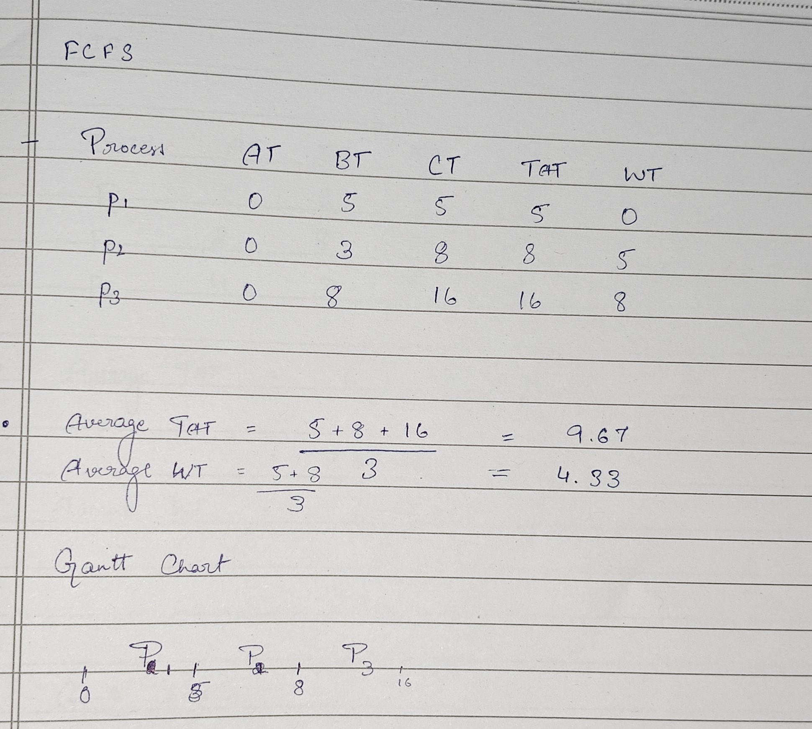

# First-Come-First-Serve(FCFS) Algorithm

Here, we start with the Initial Arrival Time(0ms) successively add the Burst time for every process, for each process's Completion Time(CT)

- TAT(Turn-around Time) = CT(Completion Time) - AT(Arrival Time)
- WT(Waiting Time) = TAT(Turn-around Time) - BT(Burst Time)

Usual Givens: AT, BT and maybe priority. 
> [!TIP]
> Preemptive Priority Scheduling is basically FCFS with a non-interruptive priority. In FCFS, priority is assigned from top to bottom(P1 having highest Priority and Pn having lowest Priority). Same way, Non-Preemptive Priority Scheduling is basically FCFS as the given priority is ignored.

We form the chart by taking the Processes in order of execution, then successively adding burst/execution time to get each completion time. 

Example: 

