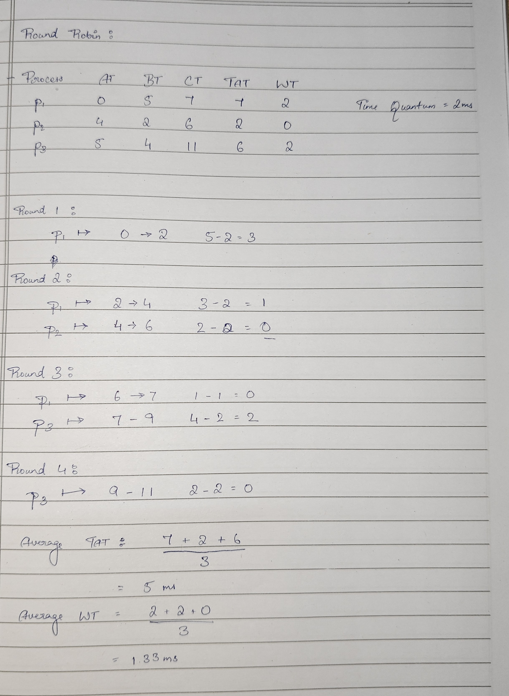

# Round-Robin Algorithm

Here, we start with the Initial Arrival Time(0ms) successively add the Execution time for every process, for each process's Completion Time(CT). 

We evaluate if the total burst time is greater than the Time Quantum given, and ask it to execute in the next round. 

TAT(Turn-around Time) = CT(Completion Time) - AT(Arrival Time)
WT(Waiting Time) = TAT(Turn-around Time) - BT(Burst Time)

Usual Givens: AT, BT, Time Quantum.

We form the chart by taking the Processes in order of execution, then successively adding execution time to get each completion time.

Chart from GeeksForGeeks

Example: 
(TQ is taken as 2)

