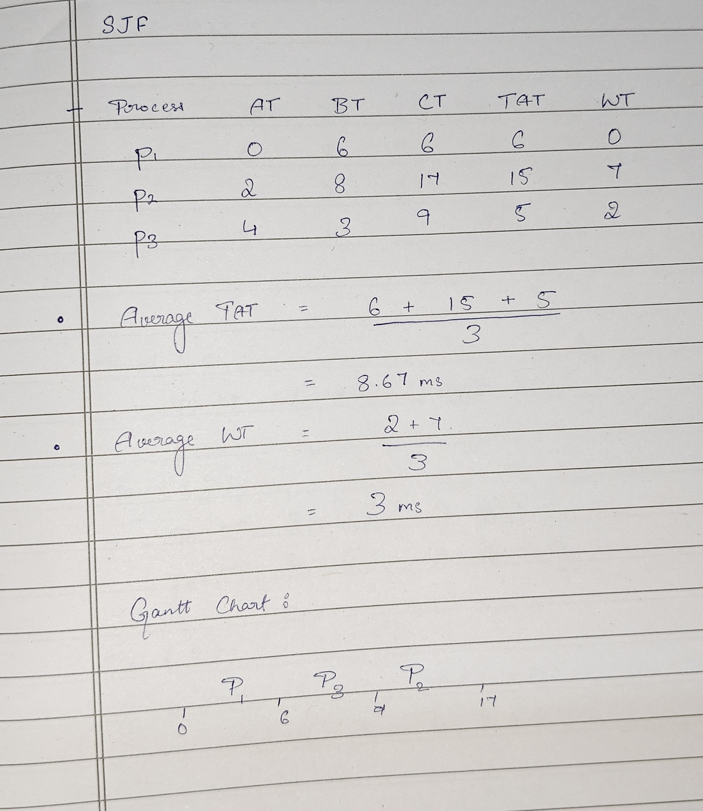

# Shortest-Job-First(SJF) Algorithm

Here, we start with the Initial Arrival Time(0ms) successively add the Burst time for every process, for each process's Completion Time(CT). 

While evaluating which process to run next, we check processes that have arrived before the previous CT(Completion Time) and schedule them next.

- TAT(Turn-around Time) = CT(Completion Time) - AT(Arrival Time)
- WT(Waiting Time) = TAT(Turn-around Time) - BT(Burst Time)

Usual Givens: AT, BT.

We form the chart by taking the Processes in order of execution, then successively adding burst/execution time to get each completion time. 

Example: 

