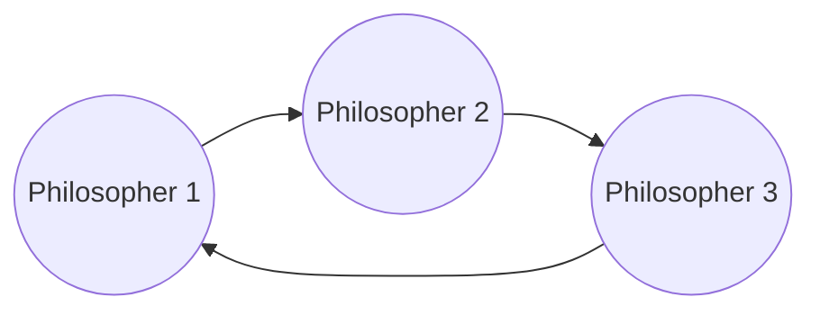
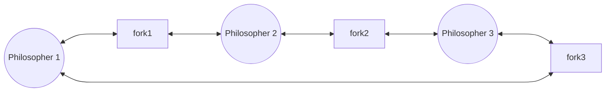

> [!WARNING]
> This Page is incomplete and answers will be added soon. 9/14 Remaining.

# Operating System Concepts
# Part A(2 marks)
## Q1. What is process control block?
## Q2. What is a system call?
System Calls are how your User level Applications, abstractions, and APIs interface with the system's resources, hardware or lower levels. This allows you to make use of the services provided by the kernel.

From Q5 in [Assignment 1](../assignments/assignment-1#q5what-is-a-system-call-explain-different-categories-of-system-calls)
## Q3. What is a race condition?
Race condition occurs when multiple threads read and write the same variable i.e. they have access to some shared data and they try to change it at the same time. 
- In such a scenario threads are “racing” each other to access/change the data. 
- This is a major security vulnerability.

[GeeksForGeeks](https://www.geeksforgeeks.org/race-condition-vulnerability/)
## Q4. What is a semaphore?
A semaphore is simply a non negative integer variable or counter that is used to keep track of the number of available shared resources for the maximum number of threads/processes allowed to access the shared resources simultaneously 
- Semaphores can be used to implement Mutual Exclusion, Co-ordination, and synchronization between multiple processes or threads

From Q2 in [ExamPrep part 1](../examprep/part1#q2-what-is-a-semaphore)
## Q5. What is inter-process communication?
Inter process communication (IPC) allows different programs or processes running on a computer to share information with each other. IPC allows processes to communicate by using different techniques like sharing memory, sending messages, or using files. It ensures that processes can work together without interfering with each other. 

[GeeksForGeeks](https://www.geeksforgeeks.org/inter-process-communication-ipc/)
## Q6. Define an operating system.
An operating system (OS) is the software that controls a computer's hardware and software. 
- It enables users to interact with the computer. 

From Q4 in [Assignment 1](../assignments/assignment-1#q4what-is-an-operating-system)
# Part B(4 marks)
## Q1. Explain "Dining Philosopher's Problem"

## Q2. Write a note on the "Critical Section Problem".
## Q3. Differentiate between pre-emptive and non-pre-emptive scheduling
## Q4. Write a note on Interprocess Communication.
## Q5. What is priority scheduling in real time systems? Explain with examples.
## Q6. Explain reader writer's problem.

# Part C(8 Marks)
All algorithms like SJF, FCFS, round robin

