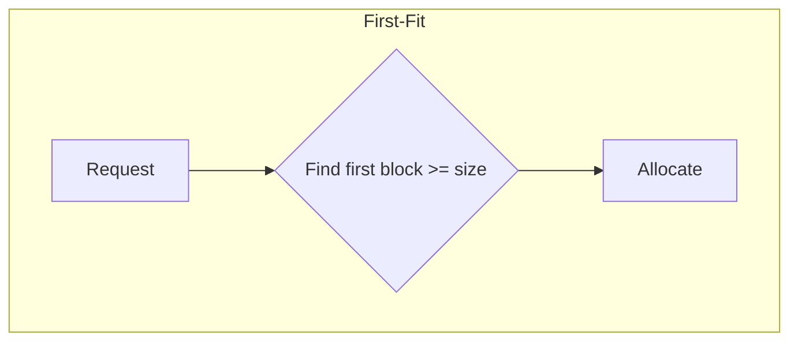
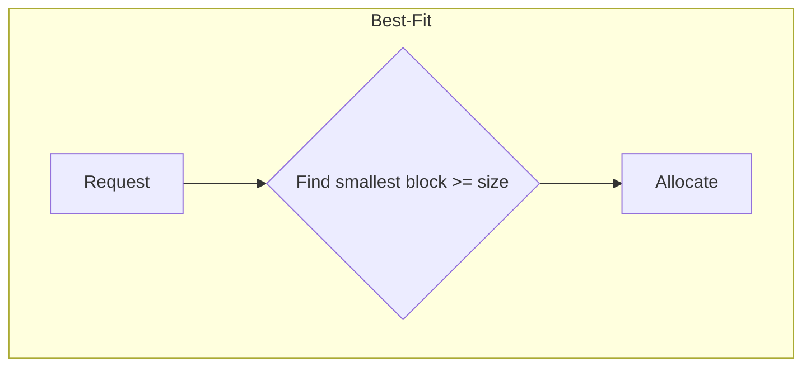
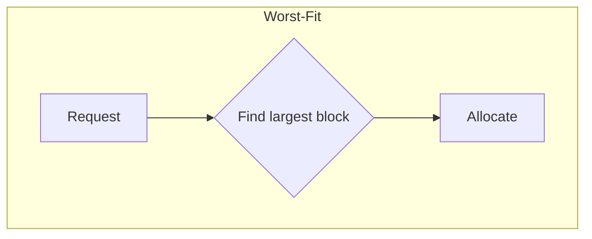

# Operating System Concepts - Unit 4 Solved

## Q1. Give a brief overview on static, dynamic linking and dynamic loading in the context of memory management
### Static Linking

Static linking is the process where all necessary library modules and code are copied directly into the final executable file at compile time
- This creates a standalone binary that does not require external libraries to run, as all dependencies are integrated within it

### Dynamic Linking

Dynamic linking, in contrast, links library code with the executable at runtime rather than compile time
- The executable only contains references to the shared library modules
- The operating system resolves these external symbols by loading the required libraries into memory when they are first needed

## Q2. Explain the functions of Memory Management along with Hardware, Address Spaces
- ***Functions of Memory Management***
    - **Allocation & Deallocation**:  
        - Allocates memory to processes when requested (`malloc()`, `new`).  
        - Releases memory after process completion (`free()`, garbage collection).  
    - **Protection & Sharing**:  
        - Prevents unauthorized access using **base-limit registers** (MMU).  
        - Allows shared memory (e.g., IPC, libraries like `glibc`).  
    - **Virtualization & Swapping**:  
        - Extends RAM via disk (**paging**, **swap space**).  
        - Uses **demand paging** (load pages only when needed).  
    - **Fragmentation Handling**:  
        - Solves **external fragmentation** (compaction, paging).  
        - Minimizes **internal fragmentation** (best-fit allocation).  

-  ***Hardware & Address Spaces***:   
    - **Key Hardware**:  
        - **CPU + MMU**: Translates **logical → physical addresses** (TLB cache).  
        - **Registers**: MAR (address), MBR (data), base-limit (protection).  
    - **Logical vs. Physical Address**:  
        - **Logical (Virtual)**: Process-generated (e.g., `0x00400000`).  
        - **Physical**: Actual RAM location (handled by **MMU**).  
    - **Memory Hierarchy**:  
        - **Cache → RAM → Disk** (swapping for virtual memory).  
    - **Address Binding**:  
        - **Compile-time** (static), **Load-time** (relocatable), **Runtime** (MMU).  

- **Example**:  
`Paging divides processes into fixed-size pages (e.g., 4KB) mapped to RAM frames, avoiding external fragmentation.`

## Q3. Explain Shared Pages, Swap and Zram <!--(f--k the syllabus, we ball here)-->
### Shared Pages

Multiple processes access the same physical memory pages, sharing common code or data. This saves RAM by avoiding duplication and speeds up inter-process communication.

### Swap

Uses a dedicated space on disk to temporarily store inactive memory pages when RAM is full. This extends virtual memory but is much slower than RAM, potentially causing performance bottlenecks.

### Zram

A Linux feature that creates a compressed swap space within RAM itself. It compresses inactive memory pages and keeps them in RAM, offering much faster performance than disk-based swap, though with some CPU overhead.

| Feature        | What it does                                  | Main Benefit                 | Main Drawback                 |
| :------------- | :-------------------------------------------- | :--------------------------- | :---------------------------- |
| **Shared Pages** | Multiple processes use same physical memory   | Saves RAM, faster IPC        | Requires reentrant data       |
| **Swap**       | Offloads inactive RAM to disk                 | Extends memory capacity      | Very slow, can cause "thrashing" |
| **Zram**       | Compresses inactive RAM pages *in* RAM        | Faster than disk swap        | Uses CPU, still limited by RAM |

## Q4. Explain Memory Partition Schemes.
Memory partition schemes are methods used to allocate memory to processes in a computer system. The two common approaches are the **Fixed Size Partition Scheme** and the **Variable Size Partition Scheme**. Each scheme has its own advantages and disadvantages, impacting how efficiently memory is utilized.
#### 1. ***Fixed Size Partition Scheme***:  
In the **Fixed Size Partition Scheme**, memory is divided into fixed-sized partitions, and each process is assigned one partition, regardless of its size. All partitions are of equal size.
- **How It Works**:
    - The system divides the available memory into several partitions of the same size.
    - Each partition is assigned to a process. If a process is smaller than the partition, the remaining space in the partition is wasted (this is called **internal fragmentation**).
    - If a process is larger than a partition, it cannot fit into the fixed-size block, and either the process is not allocated memory, or the system must implement a solution to handle such large processes.
- **Advantages**:
    - **Simplicity**: Easy to implement as memory management is straightforward.
    - **Fast Allocation**: Allocation is quick because the system simply assigns the next available partition.
    - **Low Overhead**: No need for complex data structures to manage memory allocation.
- **Disadvantages**:
    - **Internal Fragmentation**: Processes that do not use the full partition cause wasted space.
    - **Inefficient Memory Usage**: If processes are much smaller than the partition size, a lot of memory goes unused.
    - **Limited Flexibility**: Fixed partition sizes may not match the needs of dynamically changing processes.
- **Example**:  
`Imagine a system with 1GB of RAM divided into 4 fixed-size partitions, each of 250MB. If a process needs 150MB, it will be allocated one partition, leaving 100MB unused. If a process needs 300MB, it will not fit into any partition.`

#### 2. ***Variable Size Partition Scheme***:  
In the **Variable Size Partition Scheme**, memory is divided into partitions of different sizes depending on the size of the process requesting memory. This scheme allocates exactly as much memory as needed for each process.
- **How It Works**:
    - The system dynamically divides memory into partitions that can vary in size based on the needs of the processes.
    - When a process is loaded into memory, the system allocates a partition large enough to accommodate the process.
    - If a process is smaller than the partition, there may be internal fragmentation, but this is generally less of an issue than in fixed-size partitions.
- **Advantages**:
    - **No Wasted Space**: Memory is allocated in the exact amount needed, so there is no wasted space within the partition.
    - **Efficient Memory Usage**: Makes better use of available memory compared to fixed-size partitioning.
    - **Flexibility**: More flexible as memory allocation is based on actual process needs.
- **Disadvantages**:
    - **External Fragmentation**: Over time, as processes are loaded and unloaded, free memory gets scattered in small blocks. This makes it hard to allocate large contiguous blocks of memory.
    - **Complex Management**: The system needs to track variable-sized partitions and handle fragmentation efficiently.
    - **Slower Allocation**: Allocating memory may be slower because the system must search for the best fit for the process.
- **Example**:   
`A system with 1GB of RAM may allocate a 300MB partition to one process, a 500MB partition to another, and a 200MB partition to a third. In this case, the allocation is based on the actual process size, so no memory is wasted within each partition.`
## Q5. Explain First-Fit, Best-Fit and Worst-Fit Memory Allocation Strategies with advantages and disadvantages 
Of course. Here is a shorter, section-wise explanation of the First-Fit, Best-Fit, and Worst-Fit memory allocation strategies.

### First-Fit
The First-Fit algorithm scans the memory from the beginning and allocates the **first** free block that is large enough to accommodate the process's request.

*   **Advantages:**
    *   **Fast:** It is quick because it doesn't need to search the entire list of free blocks.
    *   **Simple:** Easy to implement and manage.
*   **Disadvantages:**
    *   **External Fragmentation:** Can lead to an accumulation of small, unusable memory holes at the beginning of the memory space.
    *   **Inefficient Use:** May not be the most efficient use of memory space.

### Best-Fit
The Best-Fit algorithm searches the entire list of free blocks and allocates the **smallest** block that is large enough for the process. This minimizes the size of the leftover free partition.

*   **Advantages:**
    *   **Memory Efficient:** Wastes the least amount of memory within an allocated block.
    *   **Saves Large Blocks:** Preserves larger blocks for larger processes.
*   **Disadvantages:**
    *   **Slow:** Requires searching the entire list of free blocks for every allocation.
    *   **External Fragmentation:** Tends to create many tiny, unusable memory fragments.

### Worst-Fit
The Worst-Fit algorithm searches the entire list of free blocks and allocates the **largest** available block to the process. The idea is to leave a leftover block that is large enough to be useful for future allocations.

*   **Advantages:**
    *   **Reduces Small Fragments:** Avoids creating tiny, unusable memory holes.
*   **Disadvantages:**
    *   **Slow:** Must search the entire list to find the largest block.
    *   **Wastes Large Blocks:** Quickly consumes the largest memory partitions, which may be needed for future large processes.

| Feature                 | First-Fit                               | Best-Fit                                     | Worst-Fit                                      |
| :---------------------- | :-------------------------------------- | :------------------------------------------- | :--------------------------------------------- |
| **Allocation Logic**    | First sufficient block found            | Smallest sufficient block found               | Largest sufficient block found                 |
| **Speed**               | Fast                                    | Slow (scans entire list)                     | Slow (scans entire list)                       |
| **External Fragmentation** | Can be high                             | High (many tiny fragments)                   | Lower (leaves large fragments)                 |
| **Memory Utilization**  | Good, but can be inefficient            | Best, minimizes wasted space                 | Poor, leaves large unused internal fragments  |

## Q6. Explanation Fragmentation, Segmentation and Paging

### Fragmentation
- **Definition:** Fragmentation occurs when free memory is broken into small pieces, making it difficult to allocate contiguous blocks.
- **Types:**
  - *External Fragmentation:* Free memory is scattered in small chunks, causing inefficient use of memory.
  - *Internal Fragmentation:* Allocated memory blocks have unused space inside them (e.g., unused space in a fixed-size page).
- **Advantages:** None inherently; it is a problem to be managed.
- **Disadvantages:** Leads to wasted memory space and inefficient memory utilization.

### Segmentation
- **Definition:** Memory is divided into variable-sized segments based on the logical divisions of a program (e.g., functions, data structures). Each segment is a contiguous block.
- **Advantages:**
  - No internal fragmentation (segments are exactly sized).
  - Logical view matches program structure, aiding protection and sharing.
  - Easier to relocate segments than entire address spaces.
  - Supports sharing of code/data between processes.
- **Disadvantages:**
  - Suffers from external fragmentation.
  - Difficult to allocate contiguous memory for variable-sized segments.
  - More complex and costly memory management.

### Paging
- **Definition:** Memory is divided into fixed-size blocks called pages (logical) and frames (physical). Pages can be mapped non-contiguously to frames.
- **Advantages:**
  - Eliminates external fragmentation.
  - Simple hardware-based management and fast address translation.
  - Easier to allocate and manage fixed-size pages.
  - Supports virtual memory and swapping efficiently.
- **Disadvantages:**
  - Causes internal fragmentation (unused space within pages).
  - Requires maintaining page tables, adding overhead.
  - Fixed page size reduces flexibility compared to segmentation.

| Aspect            | Fragmentation                 | Segmentation                         | Paging                                |
|-------------------|------------------------------|------------------------------------|-------------------------------------|
| Memory Division   | N/A                          | Variable-sized segments             | Fixed-size pages                    |
| Fragmentation Type | External & Internal           | External only                      | Internal only                      |
| Memory Allocation | Contiguous for segments       | Contiguous for segments             | Non-contiguous for pages            |
| Management        | Problem to solve              | Complex, software-managed           | Simple, hardware-assisted           |
| Advantages        | —                            | Logical view, no internal frag., sharing | No external frag., simple management |
| Disadvantages     | Wasted memory                | External fragmentation, complex    | Internal fragmentation, overhead    |

## Q7. Explain Frame Allocation
Frame allocation refers to the process of assigning physical memory frames (blocks of memory in RAM) to processes that are running in an operating system. Since physical memory is limited, frame allocation determines how memory is divided and assigned to different processes, which is critical for efficient system performance and memory utilization.  

In virtual memory systems, a process does not directly access physical memory but instead uses pages of data. These pages are mapped to physical frames in RAM. The operating system manages the allocation of these frames to processes. 

Example of Frame Allocation:
Imagine a system with 100 frames of physical memory and 4 processes. The operating system needs to
decide how to allocate these frames to the processes. Here are a few methods of allocation:
- Fixed Frame Allocation:
    - The operating system assigns a fixed number of frames to each process.
    - Example: If the system has 100 frames and 4 processes, the OS may allocate 25 frames to each process.
        - Process 1: 25 frames
        - Process 2: 25 frames
        - Process 3: 25 frames
        - Process 4: 25 frames
- Dynamic Frame Allocation:
    - The number of frames allocated to each process can change dynamically based on the process's needs.
    - Example: If Process 1 starts with 20 frames but later needs more memory, it might be
allocated 30 frames, while Process 2 might be reduced from 30 to 20 frames.
- Proportional Allocation:
    - Frames are allocated based on the size or priority of each process.
    - Example: The system may allocate frames proportional to the process size. If Process 1 is larger and needs more memory, it might get 60 frames, while Process 2 gets 40 frames.
<!--
Walk a homie through Page Replacement, why it is needed and its algorithms(FIFO, LIFO, LRU) with neat hood-ready diagrams
-->