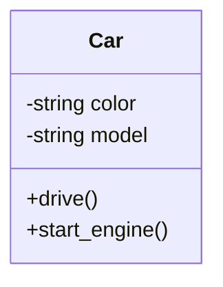
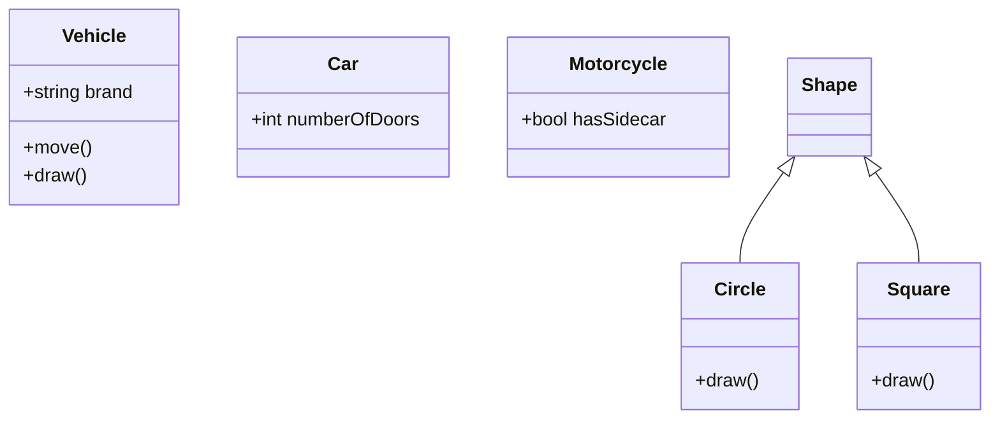
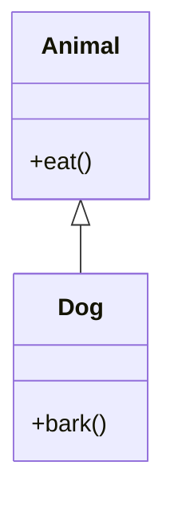
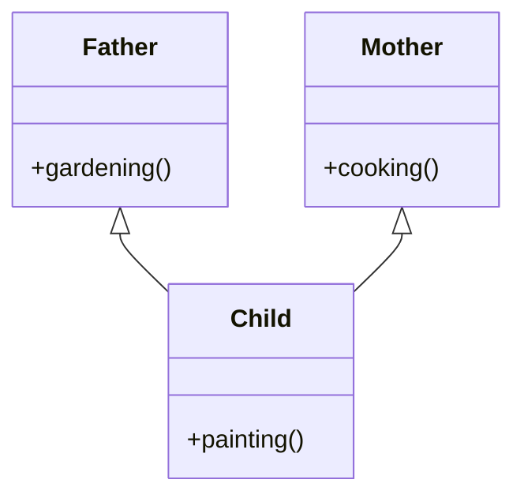
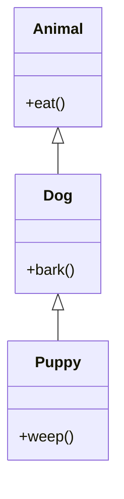
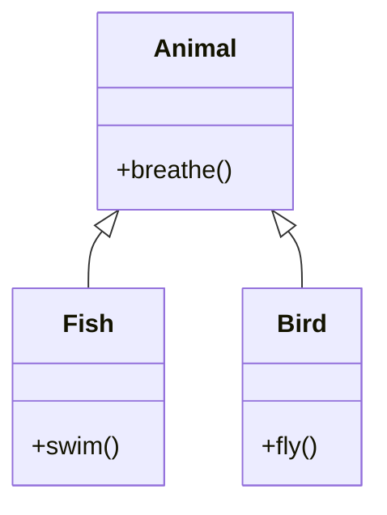
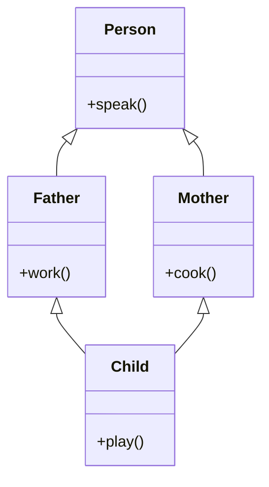

# Python Programming - Unit 4

> [!WARNING]
> This Page is incomplete and answers will be added soon. 3/9 Remaining.

## Q1. Explain file types with example. 

Text files store character data and do not have any specific encoding, which allows them to be opened and read in a standard text editor
- In Python, when you open a text file, it returns a TextIOWrapper file object. 
- Text mode is the default when working with files in Python

Examples of text files include:
- Documents: .txt, .rtf, .tex
- Source Code: .py, .java, .c, .js
- Web Standards: .html, .xml, .css, .json
- Tabular Data: .csv, .tsv
- Configuration Files: .ini, .cfg, .reg

Binary files store data in a binary format (sequences of bytes), which is computer-readable but not human-readable in a standard text editor
- Most files on a computer system are binary files. 
- Opening these files requires specific software that can interpret their format. 
- In Python, opening a binary file for reading returns a BufferedReader object, and opening one for writing returns a BufferedWriter object

Examples of binary files include:
- **Image Files**: .png, .jpg, .gif, .bmp 
- **Document Files**: .pdf, .doc, .xls
- **Audio Files**: .mp3, .wav, .aac
- **Video Files**: .mp4, .mkv, .avi
- **Archive Files**: .zip, .rar, .iso
- **Database Files**: .sqlite, .mdb
- **Executable Files**: .exe, .dll 


## Q2. Explain creating/writing/reading/appending into a file with an example.

In Python, you can perform file operations like creating, reading, writing, and appending using the built-in `open()` function. This function requires a file path and a mode to specify the intended operation.

### Creating a File

To create a new file, you can use the `open()` function with one of three modes: `"x"`, `"a"`, or `"w"`.

*   **`"x"` (Create)**: This mode creates a new file but will raise an error if a file with the same name already exists. This is useful for avoiding accidental overwrites.
*   **`"w"` (Write)**: This mode will create a file if it does not exist.
*   **`"a"` (Append)**: This mode will also create a file if it does not already exist.

**Example using `"x"` mode:**
This code creates a new, empty file named "myfile.txt".
```python
# Creates a new file; raises an error if "myfile.txt" already exists.
f = open("myfile.txt", "x")
f.close()
```

### Writing to a File

Writing to a file is done using the `"w"` mode. This mode will overwrite any existing content in the file. If the file doesn't exist, it will be created.

You can write content using two primary methods:
*   `write()`: Writes a single string to the file.
*   `writelines()`: Writes a list of strings to the file. You must add newline characters (`\n`) to separate the lines.

**Example:**
This example opens "demofile.txt" in write mode and overwrites its contents.
```python
# Open the file in write mode ("w")
with open("demofile.txt", "w") as f:
    # Overwrite the file with new content
    f.write("Woops! I have deleted the content!")

# To verify, open and read the file
with open("demofile.txt", "r") as f:
    print(f.read())
```

### Appending to a File

To add content to the end of an existing file without deleting its current data, you use the append (`"a"`) mode. If the specified file does not exist, this mode will create it. The key difference from write mode is that append does not clear the file's contents.

**Example:**
This code adds a new line to "demofile.txt" without overwriting what's already there.
```python
# Open the file in append mode ("a")
with open("demofile.txt", "a") as f:
    # Add content to the end of the file
    f.write("\nNow the file has more content!")

# To verify, open and read the file
with open("demofile.txt", "r") as f:
    print(f.read())
```

### Reading from a File

To read a file's contents, you open it in read (`"r"`) mode, which is the default mode for `open()`. Python offers several methods for reading:

*   **`read()`**: Reads the entire content of the file as a single string. You can also specify the number of characters to read, like `read(5)`.
*   **`readline()`**: Reads a single line from the file.
*   **`readlines()`**: Reads all lines from the file and returns them as a list of strings.
*   **`for` loop**: Iterating directly over the file object is a memory-efficient way to read a file line by line.

**Example:**
This example demonstrates different ways to read from "file.txt".
```python
# Assume "file.txt" contains:
# Hello!
# This is a text file.

# 1. Reading the entire file
with open("file.txt", "r") as f:
    content = f.read()
    print(content)

# 2. Reading line by line with a for loop
with open("file.txt", "r") as f:
    for line in f:
        print(line.strip()) # .strip() removes leading/trailing whitespace including newlines
```

[mimo](https://mimo.org/glossary/python/file-handling)


## Q3. tell() and seek() methods

### tell()
The tell() method returns the current file position in a file stream.

### seek(offset)
Moves the cursor to the byte position specified by offset.


### Example: 
:::details demotext.txt
```
Hello world, this is a test.
```
:::

```python
with open("demotext.txt", "w") as f:
    f.write("Hello world, this is a test.")

with open("demotext.txt", "r") as f:
    # 1. Get the initial position of the cursor
    # It starts at the beginning, so the position is 0
    print(f"Initial position: {f.tell()}")

    # 2. Read the first 5 characters ("Hello")
    content = f.read(5)
    print(f"Read content: '{content}'")

    # 3. Check the position now. It has moved 5 bytes forward.
    print(f"Position after reading 5 chars: {f.tell()}")

    # 4. Move the cursor to position 13 (the start of "this")
    f.seek(13)
    print(f"\nMoved cursor with seek(13).")
    print(f"New position: {f.tell()}")

    # 5. Read the rest of the file from the new position
    content = f.read()
    print(f"Read from new position: '{content}'")
```

::: details Output {open}
```
Initial position: 0
Read content: 'Hello'
Position after reading 5 chars: 5

Moved cursor with seek(13).
New position: 13
Read from new position: 'this is a test.'
```
:::

## Q4. Explain object oriented concepts in python. 
### **Object-Oriented Programming (OOP) in Python**

Object-Oriented Programming is a method for structuring programs by bundling related properties and behaviors into individual **objects**. It is based on the core components of classes and objects, and is guided by four main principles.

-   **Class**: A blueprint for creating objects. It defines a set of attributes (data) and methods (functions) that objects of that class will have.
-   **Object**: An instance of a class. If `Car` is the class, a specific red Ferrari is an object.

---

### **1. Encapsulation**

Encapsulation involves bundling an object's data and the methods that operate on that data into a single unit (the class). This protects the data from outside interference by controlling access.



*In the diagram, `color` and `model` are private (`-`), while the methods to interact with them are public (`+`).*

---

### **2. Inheritance**

Inheritance allows a new class (subclass or child) to inherit attributes and methods from an existing class (parent class). This promotes code reuse by creating a hierarchical relationship between classes.



*The `Shape` class is abstract, forcing `Circle` and `Square` to provide their own specific `draw()` method implementation.*

---

### **4. Polymorphism**

Meaning "many forms," polymorphism allows objects of different classes to be treated as instances of a common parent class. It lets you use a single interface (like a method name) to execute different behaviors depending on the object's type. For example, a `move()` function could be called on both `Car` and `Motorcycle` objects, and each would respond in its own way.


[RealPython](https://realpython.com/python3-object-oriented-programming/)
## Q5. Explain python inheritance. Explain types of inheritance with example. 
Inheritance is a fundamental concept in object-oriented programming that allows a new class (the child or derived class) to access and reuse the attributes and methods of an existing class (the parent or base class). This establishes a logical, hierarchical relationship between classes, promoting code reusability and making the code more organized and easier to maintain.

Python supports several types of inheritance, each modeling a different kind of relationship.

### 1. Single Inheritance
In single inheritance, a child class inherits from only one parent class. This is the most common and straightforward type of inheritance.

**Example**: A `Dog` class can inherit common properties like `eat()` from a single `Animal` parent class, while also having its own specific methods like `bark()`.



### 2. Multiple Inheritance
Multiple inheritance allows a child class to inherit from more than one parent class. This lets the child class combine features from several different base classes.

**Example**: A `Child` class could inherit skills from both a `Father` class (e.g., `gardening()`) and a `Mother` class (e.g., `cooking()`).



### 3. Multilevel Inheritance
In multilevel inheritance, a child class inherits from a parent class, which itself is a child of another class. This creates a "grandparent-parent-child" chain of inheritance.

**Example**: A `Puppy` class inherits from the `Dog` class, which in turn inherits from the `Animal` class. The `Puppy` gets methods from both `Dog` and `Animal`.



### 4. Hierarchical Inheritance
Hierarchical inheritance occurs when multiple child classes inherit from a single parent class. This is useful when several different classes share a common set of attributes or methods.

**Example**: Both a `Fish` class and a `Bird` class can inherit from a single `Animal` parent class, sharing a `breathe()` method but having unique methods like `swim()` and `fly()`.



### 5. Hybrid Inheritance
Hybrid inheritance is a combination of two or more of the other inheritance types. It is used to model more complex, real-world relationships.

**Example**: This can be a mix of hierarchical and multiple inheritance, where a `Child` class inherits from `Father` and `Mother`, and both `Father` and `Mother` inherit from a single `Person` class.



[CodewithPankaj](https://codeswithpankaj.com/inheritance-in-python-a-complete-beginners-guide/)
## Q6. Explain python private, protected and public access for variables/methods. How is it related to Encapsulation?
In Python, access modifiers are conventions used to control the visibility of class variables and methods, which is a core part of the object-oriented principle of Encapsulation. 
- Encapsulation bundles data (attributes) and the methods that operate on that data within a single unit, or class, to protect it from outside interference and misuse. 
- Python uses naming conventions with underscores to signify the intended access level of these members.


### Public Access
- By default, all variables and methods in a Python class are public
- This means they can be accessed from anywhere, both inside and outside the class, without any restrictions. 
- No special keyword is needed to declare a member as public.


### Protected Access
- A protected member is intended for use only within the class itself and by its subclasses (inheritance). 
- In Python, this is indicated by prefixing the variable or method name with a single underscore (_)
- While Python does not strictly enforce this, it serves as a strong hint to developers not to access it from outside the class hierarchy.
- eg. 
    ```python
    class Person:
        def __init__(self, name, age):
            self._name = name  # Protected variable
            self._age = age    # Protected variable
    ```

### Private Access

- Private members are intended to be accessible only from within the class where they are defined. 
- They cannot be accessed by subclasses or from outside the class
- To make a member private, its name is prefixed with a double underscore `__`
- Python enforces this by performing "name mangling," which changes the name of the attribute to make it difficult to access from outside. Any attempt to access a private member directly will result in an AttributeError.
- eg. 
    ```python
    class BankAccount:
        def __init__(self, balance):
            # This is a private variable
            self.__balance = balance

        def show_balance(self):
            # Private members are accessible inside the class
            print(f"Balance: {self.__balance}")

    b = BankAccount(5000)
    b.show_balance()  # Output: Balance: 5000

    # This will cause an error because __balance is private
    # print(b.__balance) # Raises AttributeError
    ```

[TutorialsPoint](https://www.tutorialspoint.com/access-modifiers-in-python-public-private-and-protected)


[TowardsDev](https://towardsdev.com/python-encapsulation-private-protected-and-public-oops-part-8-eb324159f59a?gi=214aab7ae4ae)

## Q7. Explain different types of Polymorphism in Python

Polymorphism in Python, derived from the Greek words "poly" (many) and "morph" (forms), refers to the ability of an entity (like a function, method, or operator) to take on different forms or behave differently depending on the context or the type of data it operates on. 
- It is a core concept in object-oriented programming (OOP) that promotes code reusability and flexibility.

### Method Overriding

This is the most common way to achieve polymorphism in Python. 
- A child class can provide a specific implementation for a method that is already defined in its parent class. 
- When the method is called on an object of the child class, the overridden method in the child class is executed instead of the parent's method.

```python
class Animal:
    def speak(self):
        print("Animal makes a sound")
class Dog(Animal):
    def speak(self):
        print("Dog barks")
class Cat(Animal):
    def speak(self):
        print("Cat meows")
animals = [Dog(), Cat(), Animal()]
for animal in animals:
    animal.speak()
```

### Operator Overloading

Python allows operators (like +, -, *) to be redefined for custom classes. This means the same operator can perform different actions depending on the data types involved. For example, the + operator performs addition for numbers and concatenation for strings.

```python
print(2 + 3)  # Addition for integers
print("Hello" + "World")  # Concatenation for strings
```

## Q8. What is a Magic Method? 

In Python, magic methods, also known as Special Methods or "dunder" methods (short for "double underscore" methods), are special methods used to define how objects behave with built-in operators and functions. 
- They allow you to customize the behavior of your classes by overriding or implementing specific functionality for common operations. 
- Magic methods are denoted by double underscores before and after their names (e.g., `__init__`, `__str__`, `__len__`, `__add__`). 
- They are not meant to be called directly by the programmer, but rather are invoked automatically by Python when certain operations are performed on objects. 
- They provide a way to interact with Python's built-in functions and operators in a customized manner within your classes. 

[AnalyticsVidhya](https://www.analyticsvidhya.com/blog/2021/08/explore-the-magic-methods-in-python/)
## Q9. Explain constructors in python
In Python, a constructor is a special method used to initialize the attributes of an object when a class is instantiated. 
- It is automatically invoked whenever a new object of a class is created. 
- The primary purpose of a constructor is to set up the initial state of the object, assigning values to its data members. 

### Default Constructor

A constructor that does not take any parameters other than self. It initializes objects with default or predefined values. 

```python
class MyClass:
    def __init__(self):
        self.attribute = "Default Value"
```

### Parameterized Constructor
A constructor that accepts additional parameters besides self. 
- These parameters are used to initialize the object's attributes with specific values provided during object creation.

```python
class MyClass:
    def __init__(self, value1, value2):
        self.attribute1 = value1
        self.attribute2 = value2
```

[Naukri](https://www.naukri.com/code360/library/python-constructor)
<!-- 
Explain file types with example. 

Explain types of operations performed on file with example. 

Explain creating/writing/reading/appending into a file with an example. 

Explain object oriented concepts in python. 

Explain python inheritance. Explain types of inheritance with example. 

Explain python private, protected and public access for variables/methods. How is it related to Encapsulation?

Explain about method overloading. 

Explain different types of Polymorphism in Python

What is a Magic Method? 
(Also Known as Special Methods)

Explain constructors in python

tell() and seek() methods

-->