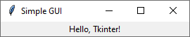

# Python Programming - Unit 5

> [!WARNING]
> This Page is incomplete and answers will be added soon. 6/11 Remaining.

## Q1. What is the Tkinter Module and tk() class? Explain features of the Tkinter Module
The Tkinter module is Python's standard, built-in library for creating Graphical User Interfaces (GUIs) for desktop applications. 
- As the standard Python interface to the Tcl/Tk GUI toolkit, it is lightweight, cross-platform (working on Windows, macOS, and Linux), and included with most Python installations, so no separate installation is needed.

The tk.Tk() class is the core component for starting a Tkinter application. 
- When you create an instance of this class (e.g., root = tk.Tk()), you are creating the main, top-level window that serves as the primary container for all other GUI elements, known as widgets.
- This root window is what the user sees as the application's main window, and the program is typically started by calling the mainloop() method on this object, which listens for user events.


Tkinter provides a variety of tools to build interactive applications. Its main features include:
- **Widget Library**: Tkinter offers a wide range of pre-built GUI components called widgets, which are the building blocks of an application. These include containers like Frame, buttons, labels, text entry boxes, checkboxes, and menus
- **Layout Management**: It includes geometry managers like pack(), grid(), and place() that control how widgets are arranged within the window, allowing for organized and responsive designs
- **Event Handling**: Tkinter has a robust event-driven model that allows you to bind functions (callbacks) to user actions, such as button clicks, mouse movements, or key presses, making the application interactive
- **Built-in Dialogs**: It provides modules for common pop-up dialogs, such as message boxes (`showinfo`, `showerror`) and file selection dialogs (`askopenfilename`), which simplifies user interaction
- **Graphic Drawing**: The Canvas widget allows for custom drawing of shapes, text, and images directly within the application window
<!--
## Q2. Name some widgets supported by Tkinter
TODO -->
## Q3. Explain the process of creating a simple GUI Application with Tkinter using a neat Diagram
### 1. Import the Tkinter Module
First, you must import the Tkinter library. It's a standard convention to import it using the alias tk to make the code shorter and more readable
### 2. Create the Main Application Window
Next, create the main window, also known as the root window. This is done by creating an instance of the Tk class. This window will serve as the container for all other GUI elements (widgets)
### 3. Add Widgets to the Window
Widgets are the building blocks of the GUI, such as buttons, labels, and text boxes
- To add a widget, you create an instance of a widget class (e.g., tk.Label) and specify its parent, which is the main window you just created.
- After creating a widget, you must add it to the window using a geometry manager like `.pack()`, `.grid()`, or `.place()`. The `.pack()` method is the simplest way to place a widget in the window
### 4. Start the Event Loop
Finally, you must call the `mainloop()` method on the main window. 
- This command displays the window and tells the program to wait for user events, like mouse clicks or key presses, until the window is closed. 
- Without `mainloop()`, the window would appear and disappear instantly


### Putting all the steps together, a very simple Tkinter application looks like this:

```python
import tkinter as tk

# 1. Create the main window
window = tk.Tk()
window.title("Simple GUI")

# 2. Add a widget
label = tk.Label(window, text="Hello, Tkinter!")

# 3. Place the widget in the window
label.pack()

# 4. Start the event loop to display the window
window.mainloop()
```


::: details Output

:::
<!-- ## Q4. What is SQLite? Explain some features of an SQLite Database from sqlite3 module
TODO
## Q5. Explain the process of creating database tables, performing read and update operations on an sqlite3 database using sqlite3 module in python
TODO
-->
## Q6. What is NumPy? Explain the features of NumPy
NumPy, short for "Numerical Python," is the fundamental open-source library for scientific computing in Python
- Its primary feature is the powerful N-dimensional array object, or ndarray, which provides an efficient way to store and operate on large, homogeneous datasets (arrays where all elements are of the same data type)
- NumPy is significantly faster than traditional Python lists because its arrays are stored in a continuous block of memory, and its core computational parts are written in high-performance languages like C and C++
- It serves as the foundational building block for many other data science libraries, including pandas, SciPy, and scikit-learn

NumPy's power comes from a rich set of features designed for high-performance numerical operations:
- Multidimensional Arrays: The core of NumPy is the ndarray object, which allows for the efficient creation and manipulation of vectors, matrices, and higher-dimensional arrays
- Element-wise Operations: NumPy allows you to perform mathematical operations on entire arrays at once without writing explicit loops, a concept known as vectorization. This makes the code cleaner and much faster
- Broadcasting: This powerful feature enables NumPy to perform operations on arrays of different shapes and sizes, simplifying calculations by automatically expanding the smaller array to match the larger one
- Mathematical Functions: It includes a vast collection of high-level mathematical functions for operations in linear algebra, statistical analysis, Fourier transforms, and more
- Memory Efficiency: NumPy arrays are more memory-efficient than Python lists, especially for large datasets, due to their contiguous memory storage
- Advanced Indexing and Slicing: It offers flexible and powerful ways to access, select, and manipulate data within arrays
- Integration with Other Libraries: NumPy integrates seamlessly with other scientific computing libraries, forming the backbone of the Python data science ecosystem

[DevOpsSchool](https://www.devopsschool.com/blog/what-is-numpy-and-use-cases-of-numpy/)
## Q7. Explain 4 Operations on NumPy Arrays with examples. 
NumPy arrays support a wide range of fast and efficient operations. These operations are vectorized, meaning they are applied to entire arrays at once without the need for explicit Python loops. Here are four fundamental types of operations you can perform on NumPy arrays.

### 1. Element-wise Arithmetic
Standard arithmetic operators like `+`, `-`, `*`, and `/` operate on an element-by-element basis. This means the operation is applied to each corresponding pair of elements in the arrays. The arrays must either have the same shape or be compatible for broadcasting.

**Example:**
```python
import numpy as np

# Create two arrays
array1 = np.array([10, 20, 30, 40])
array2 = np.array([1, 2, 3, 4])

# Addition
addition_result = array1 + array2
print(f"Addition: {addition_result}")

# Multiplication
multiplication_result = array1 * array2
print(f"Multiplication: {multiplication_result}")
```
**Output:**
```
Addition: [11 22 33 44]
Multiplication: [ 10  40  90 160]
```

### 2. Aggregation (Reductions)
Aggregation functions compute a summary statistic, like a sum or mean, across an array. These methods can be applied to the entire array or along a specific axis (rows or columns).

**Example:**
```python
import numpy as np

# Create a 2D array (matrix)
matrix = np.array([[1, 2], [3, 4]])

# Sum of all elements
total_sum = matrix.sum()
print(f"Total Sum: {total_sum}")

# Sum along columns (axis=0)
column_sum = matrix.sum(axis=0)
print(f"Sum of columns: {column_sum}")

# Sum along rows (axis=1)
row_sum = matrix.sum(axis=1)
print(f"Sum of rows: {row_sum}")
```
**Output:**
```
Total Sum: 10
Sum of columns: [4 6]
Sum of rows: [3 7]
```

### 3. Matrix Multiplication
While the `*` operator performs element-wise multiplication, it is not used for matrix multiplication. For true matrix multiplication, Python (version 3.5+) uses the `@` operator or NumPy's `.dot()` method.

**Example:**
```python
import numpy as np

matrix_A = np.array([[1, 1], [0, 1]])
matrix_B = np.array([[2, 0], [3, 4]])

# Element-wise product (NOT matrix multiplication)
elementwise_product = matrix_A * matrix_B
print(f"Element-wise Product:\n{elementwise_product}")

# Matrix product
matrix_product = matrix_A @ matrix_B
print(f"\nMatrix Product:\n{matrix_product}")
```

**Output:**
```
Element-wise Product:
[[2 0]
 [0 4]]

Matrix Product:
[[5 4]
 [3 4]]
```

### 4. Comparisons
You can compare two arrays element-wise using standard comparison operators like `==`, `>`
- The result is a new boolean array where each element is True or False based on the comparison of the corresponding elements in the original arrays

```python
import numpy as np

array_a = np.array([1, 2, 3, 4])
array_b = np.array([4, 2, 2, 4])

# Check for equality
equality_check = (array_a == array_b)
print(f"Equality check: {equality_check}")

# Check which elements in array_a are greater than 2
greater_than_check = (array_a > 2)
print(f"Greater than 2: {greater_than_check}")
```
**Output:**
```
Equality check: [False  True False  True]
Greater than 2: [False False  True  True]
```

[NumPy DevDocs](https://numpy.org/devdocs/user/absolute_beginners.html)


<!--
## Q8. Explain the importance of Data Visualization
TODO
-->
## Q9. What is matplotlib? Mention its Features.
Matplotlib is a comprehensive and widely-used plotting library for the Python programming language and frequently used alongside its numerical extension, NumPy
- It is considered a foundational data visualization utility, allowing users to create a wide variety of static, animated, and interactive graphs and plots with just a few lines of code. 
- Matplotlib is designed to produce publication-quality figures and integrates seamlessly into the broader Python data science ecosystem.


Matplotlib provides a robust set of features that make it a versatile tool for data visualization:

- **Wide Variety of Plots**: It supports a diverse range of 2D plots, including line charts, bar graphs, scatter plots, histograms, and pie charts
- **High-Quality Output**: The library is designed to produce high-quality, publication-ready figures that can be fine-tuned for professional use
- **Extensive Customization**: Users have full control over nearly every element of a plot, such as line styles, colors, fonts, and axes properties, allowing for highly personalized visualizations
- **Multiple Output Formats**: Plots can be saved and exported in many common file formats, including PNG, PDF, SVG, and JPEG, making them easy to use in reports and presentations
- **Seamless Integration**: Matplotlib works well with other popular Python libraries, particularly NumPy and pandas, allowing for direct plotting of data from their data structures
- **Interactive Figures**: It can generate interactive plots that allow users to zoom, pan, and update the visualization, which is especially useful for data exploration in environments like Jupyter notebooks
- **Extensible Framework**: Matplotlib serves as the foundation for many other high-level plotting libraries, such as seaborn and Cartopy, which extend its functionality for more specific use cases


[MatPlotLib](https://matplotlib.org/)

[Wikipedia](https://en.wikipedia.org/wiki/Matplotlib)
<!--
## Q10. Mention a few matplotlib methods and some of their parameters
TODO
## Q11. Explain different types of Charts supported by matplotlib
TODO
-->

<!--

What is the Tkinter Module and tk() class? Explain features of the Tkinter Module

Name some widgets supported by Tkinter

Explain the process of creating a simple GUI Application with Tkinter using a neat Diagram

Explain the importance of Data Visualization

What is SQLite? Explain some features of an SQLite Database from sqlite3 module

Explain the process of creating database tables, performing read and update operations on an sqlite3 database using command prompt

Explain the process of creating database tables, performing read and update operations on an sqlite3 database using sqlite3 module in python


What is NumPy? Explain the features of NumPy

Explain NumPy arrays with an example. 

Explain 4 Operations on Arrays with examples. 

What is matplotlib? Mention its Features.

Mention a few matplotlib methods and some of their parameters

Explain different types of Charts supported by matplotlib

-->