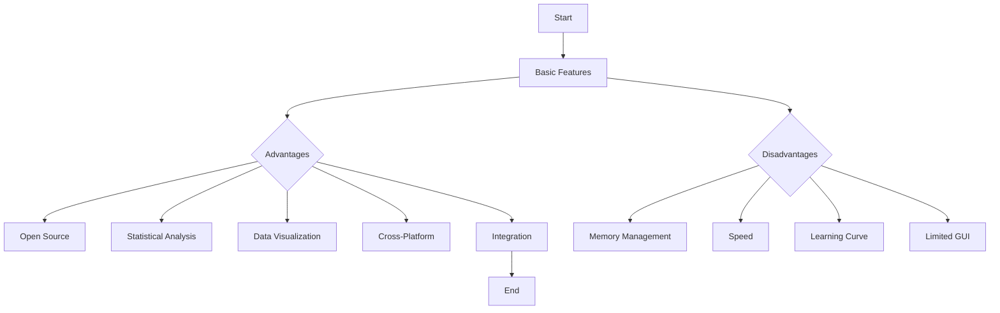
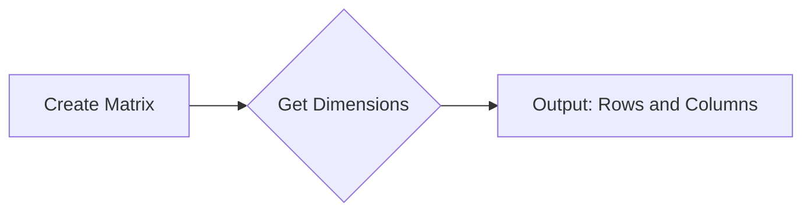
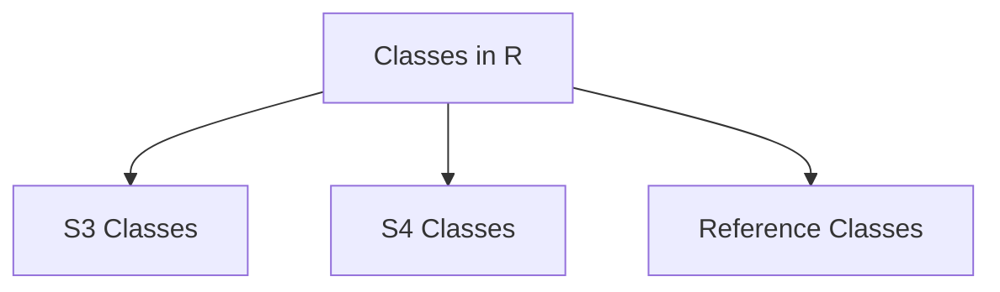
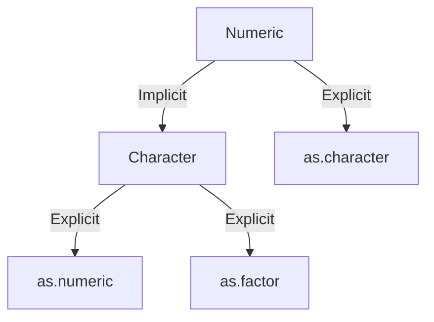
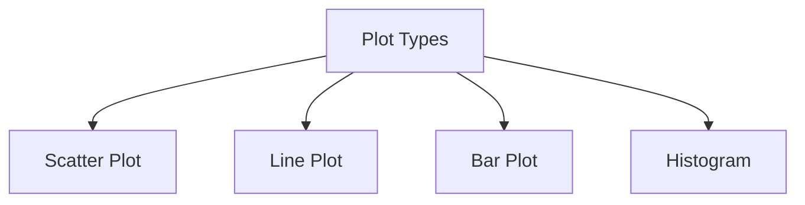

# R Programming - Unit 1

## 1. What are the basic features, Advantages and Disadvantages of R programming


#### Basic Features of R Programming

- **Statistical Computing**: Designed for statistical analysis and data visualization.
- **Data Handling**: Supports various data formats like CSV, Excel, and databases.
- **Packages**: Extensive libraries (CRAN) for diverse statistical techniques and data manipulation.
- **Visualization**: Powerful plotting libraries (e.g., ggplot2) for graphical data representation.
- **Community Support**: Strong user community and extensive documentation.

#### Advantages of R Programming

- **Open Source**: Free to use and distribute.
- **Statistical Analysis**: Rich set of tools for statistical modeling.
- **Data Visualization**: High-quality graphical outputs.
- **Cross-Platform**: Runs on Windows, macOS, and Linux.
- **Integration**: Works well with other programming languages and technologies.

#### Disadvantages of R Programming

- **Memory Management**: Can be less efficient with large datasets.
- **Speed**: Slower execution compared to some compiled languages.
- **Learning Curve**: Steeper for those without a statistical background.
- **Limited GUI**: Primarily command-line based, which may be challenging for some users.

#### Simple R Code Example

```r
# Simple R code to create a basic plot
data <- c(1, 2, 3, 4, 5)
plot(data, type = "o", col = "blue", main = "Simple Line Plot", xlab = "Index", ylab = "Value")
```

#### Time and Space Complexity

For basic operations in R, like the plot above, the time complexity is generally:

- **Time Complexity**: $O(n)$
- **Space Complexity**: $O(n)$

#### Diagram Representation

Here’s a simple flowchart of R programming features using Mermaid:



This concise overview should provide a solid foundation for understanding R programming's core aspects.

<sub>This was AI generated from github copilot on 2025-12-23</sub>


## 2. Basic Data Types, Lists, Data Frames, Matrices, Arrays, Vectors, Operators and respective Operations in R


#### Basic Data Types in R

R has several fundamental data types:

- **Numeric**: Represents numbers (e.g., `5.0`, `3.14`).
- **Integer**: Whole numbers, denoted with an `L` (e.g., `5L`).
- **Character**: Strings of text (e.g., `"Hello"`).
- **Logical**: Boolean values (`TRUE` or `FALSE`).

#### Vectors

A vector is a sequence of elements of the same type.

```r
numeric_vector <- c(1.5, 2.5, 3.5)  # Numeric vector
char_vector <- c("A", "B", "C")      # Character vector
```

#### Lists

Lists can contain elements of different types.

```r
my_list <- list(name = "John", age = 30, scores = c(90, 85, 92))
```

#### Data Frames

Data frames are tables where each column can contain different types.

```r
my_data_frame <- data.frame(Name = c("John", "Alice"), Age = c(30, 25))
```

#### Matrices

Matrices are two-dimensional arrays of elements of the same type.

```r
my_matrix <- matrix(1:6, nrow = 2, ncol = 3)  # 2 rows, 3 columns
```

#### Arrays

Arrays can have multiple dimensions.

```r
my_array <- array(1:12, dim = c(3, 2, 2))  # 3x2x2 array
```

#### Operators and Operations

Operators in R can be categorized as follows:

- **Arithmetic Operators**: `+`, `-`, `*`, `/`, `^`
- **Relational Operators**: `==`, `!=`, `<`, `>`, `<=`, `>=`
- **Logical Operators**: `&`, `|`, `!`

Example of operations:

```r
# Arithmetic Operation
result <- numeric_vector + 10  # Adds 10 to each element in the numeric vector
```

R is a versatile language used for statistical computing and graphics, making these structures essential for data manipulation and analysis.

<sub>This was AI generated from github copilot on 2025-12-23</sub>


## 3. Use of dim function


#### R Programming: `dim` Function

The `dim` function in R is used to retrieve or set the dimensions of an object, typically matrices or arrays. It returns the number of rows and columns of the object, allowing users to understand its structure.

##### Usage

```R
# Create a matrix
matrix_data <- matrix(1:6, nrow=2, ncol=3)

# Retrieve dimensions
dimensions <- dim(matrix_data)

# Print dimensions
print(dimensions)  # Outputs: [1] 2 3
```

In this example:
- A matrix is created with 2 rows and 3 columns.
- The `dim` function retrieves the dimensions, which will be shown as a vector of length 2.

##### Complexity

The time complexity of accessing dimensions is $O(1)$, and the space complexity is also $O(1)$ since it returns a fixed-size vector.



<sub>This was AI generated from github copilot on 2025-12-23</sub>


## 4. Classes and types of classes in R


#### Classes and Types of Classes in R

In R, a class is a blueprint for creating objects. It defines the structure and behavior of the objects. R supports various classes and has a flexible object-oriented system primarily based on three paradigms: S3, S4, and Reference Classes.

##### 1. S3 Classes
- Informal and simple.
- Uses a naming convention, where the class name is assigned as an attribute.
  
Example:
```r
# Define an S3 class
person <- function(name, age) {
  structure(list(name = name, age = age), class = "person")
}

# Create an object of class 'person'
john <- person("John", 30)
```

##### 2. S4 Classes
- More formal and structured.
- Requires explicit definition of the class and its slots (attributes).

Example:
```r
# Load methods package
library(methods)

# Define an S4 class
setClass("Person", 
         slots = list(name = "character", age = "numeric"))

# Create an object of class 'Person'
john <- new("Person", name = "John", age = 30)
```

##### 3. Reference Classes
- Similar to traditional object-oriented programming.
- Supports reference semantics, meaning objects are mutable.

Example:
```r
# Define a Reference Class
Person <- setRefClass("Person",
                       fields = list(name = "character", age = "numeric"))

# Create an object of class 'Person'
john <- Person$new(name = "John", age = 30)
```

##### Summary of Class Types



Each class type serves different use cases, from simple data structures (S3) to more complex systems requiring formal definitions (S4) or mutable objects (Reference Classes).

<sub>This was AI generated from github copilot on 2025-12-23</sub>


## 5. Coercion and types of coercion in R


#### Coercion in R

Coercion in R refers to the automatic conversion of data types when performing operations. R has several types of coercion that allow it to handle different data types together.

##### Types of Coercion:

1. **Implicit Coercion**: This occurs when R automatically converts one data type to another.
   - Example: Combining numeric and character types results in character type.

2. **Explicit Coercion**: This occurs when the user explicitly converts data types using functions.
   - Functions include:
     - `as.numeric()`
     - `as.character()`
     - `as.factor()`

##### Simple Code Example:

```r
# Implicit Coercion
num <- 5
char <- "Hello"
result <- num + char  # Here, num is coerced to character
print(result)  # Output: "5Hello"

# Explicit Coercion
num2 <- "10"
num3 <- as.numeric(num2)  # Convert character to numeric
print(num3)  # Output: 10
```

##### Coercion Diagram:



##### Complexity

The time complexity for coercion functions is generally O(n), where n is the number of elements being coerced. The space complexity is also O(n) for storing the new data type.

<sub>This was AI generated from github copilot on 2025-12-23</sub>


## 6. Basic plotting
- Plot types in R
- Simple Syntax


#### R Programming: Basic Plotting

R is a powerful language for statistical computing and data visualization. One of its core functionalities is the ability to create various types of plots with simple syntax.

##### Basic Plot Types in R

1. **Scatter Plot**: Displays values for typically two variables for a set of data.
2. **Line Plot**: Shows data points connected by lines, useful for time series.
3. **Bar Plot**: Represents categorical data with rectangular bars.
4. **Histogram**: Visualizes the distribution of numerical data.

##### Simple Syntax for Plotting

Here’s a basic example of how to create these plots in R:

```r
# Sample Data
x <- 1:10
y <- x^2

# Scatter Plot
plot(x, y, main="Scatter Plot", xlab="X-axis", ylab="Y-axis", col="blue", pch=19)

# Line Plot
plot(x, y, type="l", main="Line Plot", xlab="X-axis", ylab="Y-axis", col="red")

# Bar Plot
barplot(y, names.arg=x, main="Bar Plot", xlab="X-axis", ylab="Values", col="green")

# Histogram
hist(y, main="Histogram", xlab="Values", col="purple", breaks=5)
```

##### Complexity Analysis

The time and space complexity of plotting operations generally depend on the data size $n$ being plotted, leading to the following:

- **Time Complexity**: $O(n)$
- **Space Complexity**: $O(n)$

##### Mermaid Flowchart of Plot Types



This encapsulates the core plotting capabilities in R, providing a straightforward framework for visualizing data.

<sub>This was AI generated from github copilot on 2025-12-23</sub>