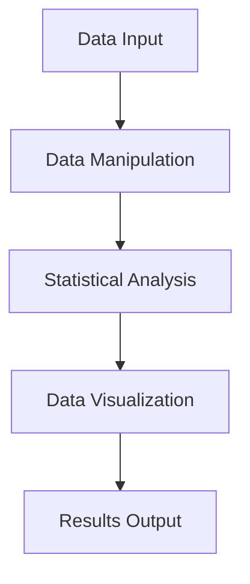
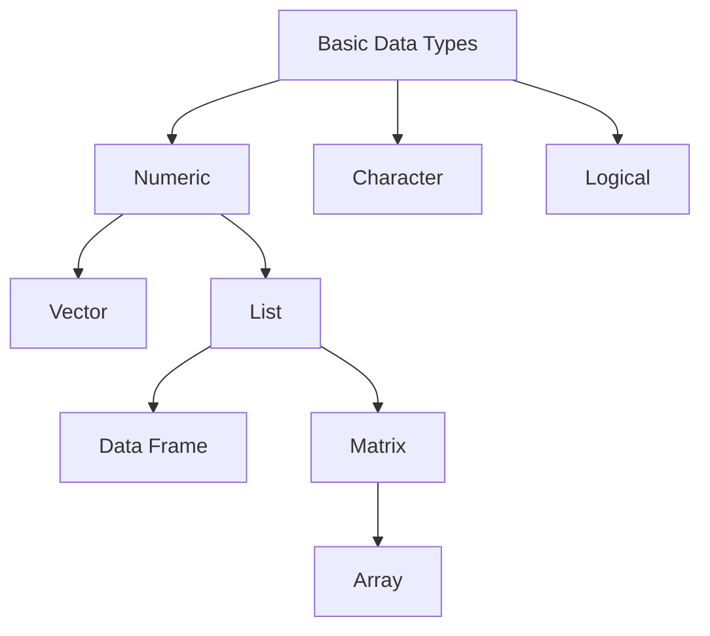
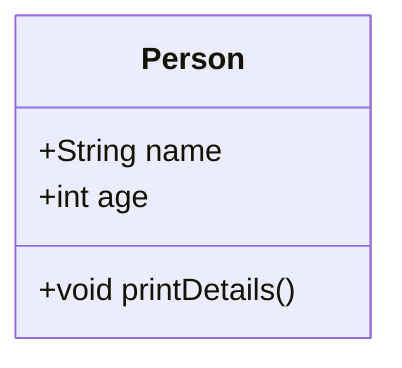
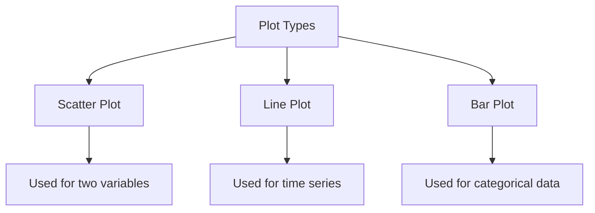

# R Programming - Unit 1

## 1. What are the basic features, Advantages and Disadvantages of R programming


#### Basic Features of R Programming

R is a programming language and environment primarily used for statistical computing and graphics. Key features include:

- **Data Handling**: Efficient for data manipulation and analysis.
- **Statistical Techniques**: Supports a wide array of statistical tests and models.
- **Graphics**: Excellent visualization capabilities through packages like ggplot2.
- **Packages**: Extensive repository of libraries (CRAN) for various applications.
- **Interactivity**: Supports interactive data analysis and visualization.

#### Advantages of R Programming

- **Open Source**: Free to use and widely supported by the community.
- **Statistical Power**: Rich in statistical functions and modeling capabilities.
- **Data Visualization**: High-quality graphics and visualization options.
- **Community Support**: Large user community for troubleshooting and resources.

#### Disadvantages of R Programming

- **Performance**: Slower than some languages (e.g., Python, C++) for large datasets.
- **Memory Consumption**: Can be memory-intensive, limiting scalability.
- **Learning Curve**: Steeper learning curve for beginners unfamiliar with programming.

#### Simple R Code Example

```R
# Basic R code to create a simple scatter plot
data <- data.frame(x = rnorm(100), y = rnorm(100))  # Generate random data
plot(data$x, data$y, main = "Scatter Plot", xlab = "X-axis", ylab = "Y-axis")  # Create scatter plot
```

#### Visualization of R's Workflow



#### Time and Space Complexity

For a basic statistical operation, the time complexity can be approximated as:

- **Time Complexity**: \( O(n) \) for single-pass calculations.
- **Space Complexity**: \( O(n) \) for storing the dataset.

This provides a concise overview of R programming's fundamental aspects, advantages, and limitations.

<sub>This was AI generated from github copilot on 2025-12-23</sub>


## 2. Basic Data Types, Lists, Data Frames, Matrices, Arrays, Vectors, Operators and respective Operations in R


#### Basic Data Types in R

R supports several basic data types:

- **Numeric**: Numbers (e.g., `3.14`)
- **Integer**: Whole numbers (e.g., `2L`)
- **Character**: Text strings (e.g., `"Hello"`)
- **Logical**: TRUE or FALSE values

#### Vectors

A vector is a basic data structure in R that contains elements of the same type.

```r
# Creating a numeric vector
numeric_vector <- c(1.5, 2.5, 3.5)
```

#### Lists

Lists are versatile structures that can hold elements of different types.

```r
# Creating a list
my_list <- list(name = "Alice", age = 25, scores = c(90, 85, 88))
```

#### Data Frames

Data frames are tables where each column can contain different types.

```r
# Creating a data frame
my_data_frame <- data.frame(Name = c("Alice", "Bob"), Age = c(25, 30))
```

#### Matrices

Matrices are two-dimensional arrays where all elements are of the same type.

```r
# Creating a matrix
my_matrix <- matrix(1:6, nrow = 2, ncol = 3)
```

#### Arrays

Arrays are similar to matrices but can have more than two dimensions.

```r
# Creating a 3D array
my_array <- array(1:12, dim = c(2, 2, 3))
```

#### Operators and Operations

R includes various operators for arithmetic and logical operations. Here’s a short summary:

- **Arithmetic Operators**: `+`, `-`, `*`, `/`, `^`
- **Logical Operators**: `&`, `|`, `!`, `==`, `!=`

Example of operations:

```r
# Arithmetic operation
sum_result <- 10 + 5  # 15

# Logical operation
logical_result <- TRUE & FALSE  # FALSE
```

#### Diagram of R Data Structures



This concise overview covers the essential data structures and operations in R, providing a foundation for further exploration.

<sub>This was AI generated from github copilot on 2025-12-23</sub>


## 3. Use of dim function


#### R Programming Overview

R is a programming language and environment primarily used for statistical computing and graphics. It provides a wide variety of statistical and graphical techniques and is widely used among statisticians and data miners.

#### Using the `dim` Function

The `dim` function in R is used to get or set the dimensions of an object, such as a matrix or a data frame. It returns a vector that contains the number of rows and columns.

##### Example Code

```r
# Create a matrix
matrix_data <- matrix(1:6, nrow = 2, ncol = 3)

# Get dimensions of the matrix
dimensions <- dim(matrix_data)

# Print dimensions
print(dimensions)  # Output: [1] 2 3
```

#### Time and Space Complexity

The `dim` function operates in constant time, \(O(1)\), as it simply accesses the attributes of the object. The space complexity is also \(O(1)\) since it returns a fixed size vector.

```latex
\text{Time Complexity: } O(1) \\
\text{Space Complexity: } O(1)
```

#### Mermaid Flowchart

To illustrate the flow of using the `dim` function in R:

```mermaid
flowchart TD
    A[Create Matrix] --> B{Call dim()}
    B --> C[Get Dimensions]
    C --> D[Print Dimensions]
```

This flowchart represents the simple steps to create a matrix, use the `dim` function, and print the dimensions.

<sub>This was AI generated from github copilot on 2025-12-23</sub>


## 4. Classes and types of classes in R


#### R Programming: Classes and Types of Classes

In R, classes are used to create objects that can have specific attributes and methods. There are several types of classes in R, primarily focusing on:

- **Base Classes**: These are the default classes like `numeric`, `character`, `logical`, and `list`.
- **S3 Classes**: A simple and informal way to create classes based on existing types. It uses a structure and naming convention.
- **S4 Classes**: A more formal and rigorous approach that defines classes and methods with explicit definitions.
- **Reference Classes (RC)**: These allow for mutable objects and use a different syntax to create objects.

##### Example of Creating an S3 Class

```r
# Define an S3 class
person <- function(name, age) {
  structure(list(name = name, age = age), class = "person")
}

# Create an instance of the class
john <- person("John", 30)

# Print the object
print(john)
```

##### Mermaid Diagram: Class Structure



### Time and Space Complexity

For object creation in R, the time complexity is generally O(1) since it involves assigning values. The space complexity is also O(1) for the basic creation of an object.

This provides a concise overview of classes in R and a simple example to help understand the concept.

<sub>This was AI generated from github copilot on 2025-12-23</sub>


## 5. Coercion and types of coercion in R


#### Coercion in R

Coercion in R refers to the process of converting one data type into another. This happens automatically or explicitly in R, allowing for consistent data handling in operations.

##### Types of Coercion

1. **Numeric Coercion**: Converting logical or character values into numeric.
2. **Character Coercion**: Converting numeric or logical values into character strings.
3. **Logical Coercion**: Converting numeric or character values into logical values (TRUE/FALSE).

#### Mermaid Diagram

```mermaid
flowchart TD
    A[Data Types] -->|Coerced to| B[Numeric]
    A -->|Coerced to| C[Character]
    A -->|Coerced to| D[Logical]
    B -->|Example: 1, 0| E[TRUE, FALSE]
    C -->|Example: "5"| F[5]
```

##### Simple R Code Example

```r
# Numeric to Logical Coercion
num <- 1
logical_val <- as.logical(num)  # TRUE

# Character to Numeric Coercion
char <- "3.14"
num_val <- as.numeric(char)      # 3.14

# Logical to Numeric Coercion
logical <- FALSE
num_from_logical <- as.numeric(logical)  # 0
```

#### Complexity Analysis

- **Time Complexity**: \(O(n)\) for conversion operations where \(n\) is the length of the vector.
- **Space Complexity**: \(O(1)\) for in-place conversions, but can be \(O(n)\) for creating new objects.

<sub>This was AI generated from github copilot on 2025-12-23</sub>


## 6. Basic plotting
- Plot types in R
- Simple Syntax


#### R Programming: Basic Plotting

R is a powerful programming language for statistical computing and graphics. It provides multiple types of plots to visualize data easily. 

##### Basic Plot Types in R

Here are some common plot types:

- **Scatter Plot**: Displays values for typically two variables for a set of data.
- **Line Plot**: Shows data points connected by straight lines, often used for time series.
- **Bar Plot**: Represents categorical data with rectangular bars.

##### Simple Syntax Example

Here’s a simple example of how to create a scatter plot in R:

```r
# Sample data
x <- c(1, 2, 3, 4, 5)
y <- c(2, 3, 5, 7, 11)

# Create a scatter plot
plot(x, y, main = "Scatter Plot", xlab = "X-axis", ylab = "Y-axis", col = "blue", pch = 19)
```

##### Visualization of Plot Types

To visualize the relationship between plot types, you can use a flowchart:



##### Conclusion

R's plotting functions enable quick and efficient visualization of data through simple syntax and various plot types, making it an essential tool for data analysis.

<sub>This was AI generated from github copilot on 2025-12-23</sub>