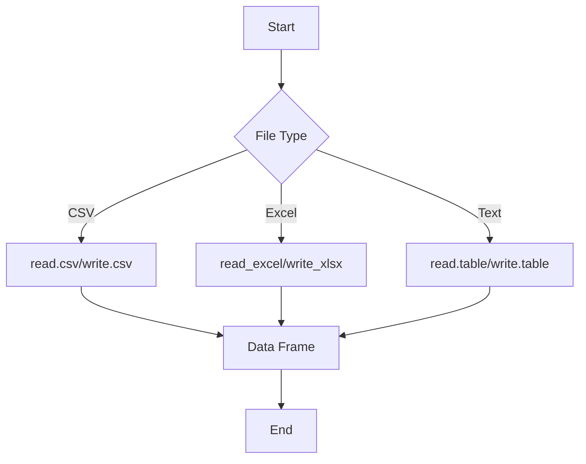
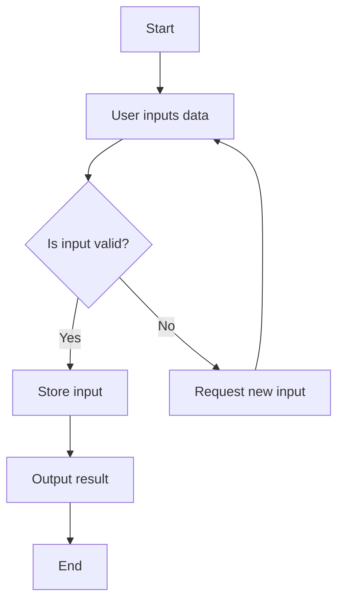
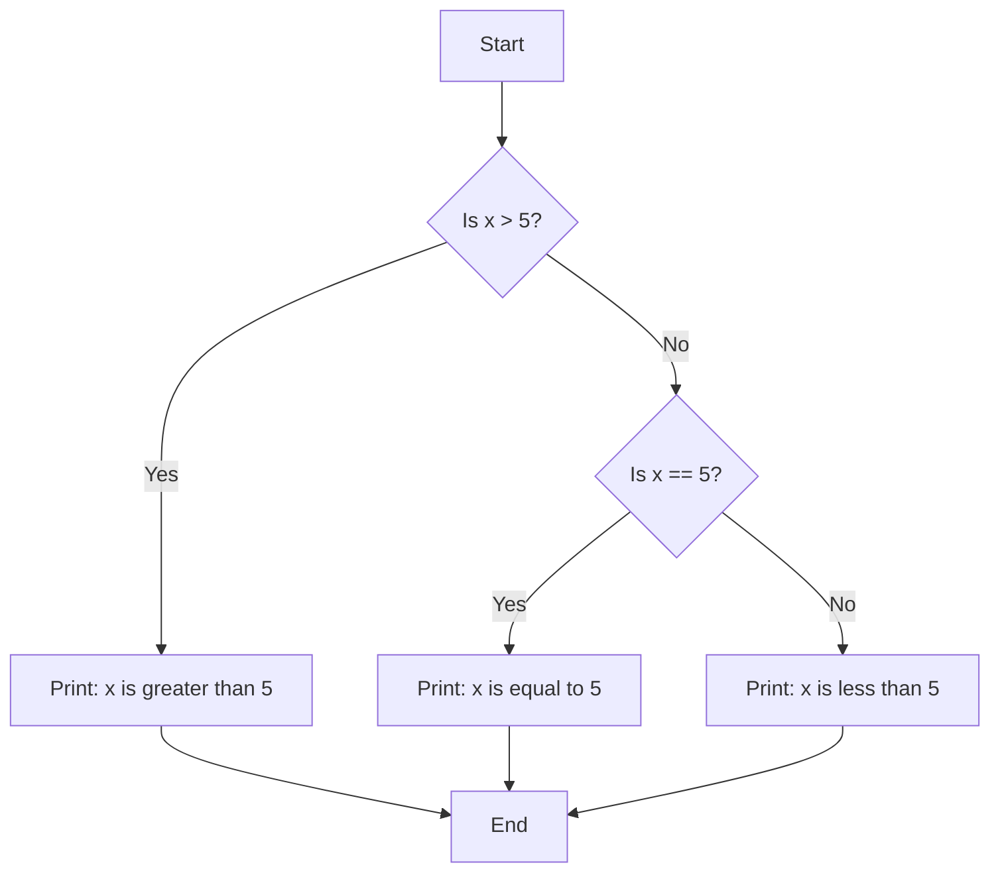
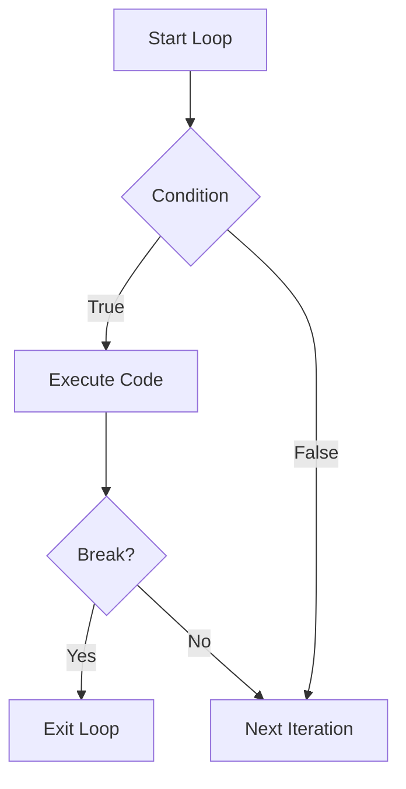
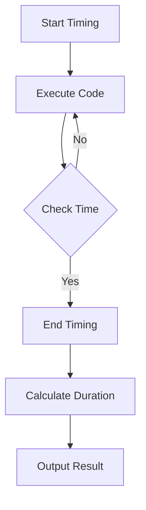
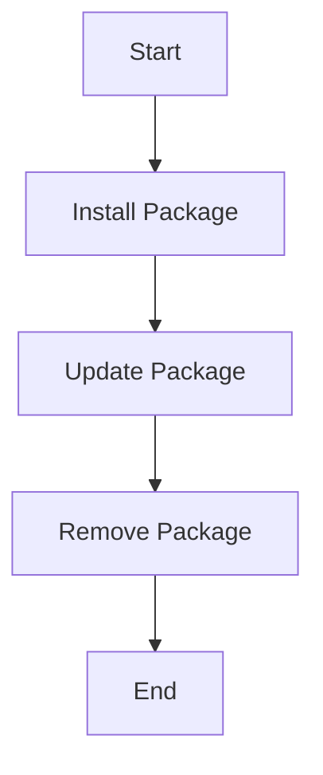

# R Programming - Unit 2

## 1. Reading and writing files in R


#### Reading and Writing Files in R

R provides various functions to read and write data from different file types. Below is a breakdown of common file types and their corresponding R functions.

##### CSV Files

```r
# Reading a CSV file
data_csv <- read.csv("data.csv")

# Writing to a CSV file
write.csv(data_csv, "output.csv", row.names = FALSE)
```

##### Excel Files

```r
# Install the readxl package if not installed
install.packages("readxl") # Run this line once

# Reading an Excel file
library(readxl)
data_excel <- read_excel("data.xlsx")

# Install the writexl package if not installed
install.packages("writexl") # Run this line once

# Writing to an Excel file
library(writexl)
write_xlsx(data_excel, "output.xlsx")
```

##### Text Files

```r
# Reading a text file
data_txt <- read.table("data.txt", header = TRUE)

# Writing to a text file
write.table(data_txt, "output.txt", row.names = FALSE)
```

##### Mermaid Flowchart

Here's a simple flowchart to visualize the process of reading and writing files in R:



### Complexity

The time complexity for reading and writing files is generally O(n), where n is the number of rows. The space complexity is also O(n) due to the storage of data in memory.

<sub>This was AI generated from github copilot on 2025-12-23</sub>


## 2. Input and Output statements in R


#### R Programming Overview

R is a programming language primarily used for statistical computing and data analysis. It provides a variety of tools for data manipulation, statistical modeling, and graphical representation.

#### Input and Output in R

R has built-in functions for handling input and output, which are crucial for data processing. The most common functions are `print()` for output and `scan()` for input.

```r
# Example of Input and Output in R

# Input: Read user input
user_input <- scan(what = "", n = 1, prompt = "Enter something: ")

# Output: Print the user input
print(paste("You entered:", user_input))
```

#### Mermaid Diagram

Below is a simple flowchart illustrating the process of input and output in R:



#### Time and Space Complexity

The input/output operations in R generally have:

- **Time Complexity**: \(O(n)\) for reading and writing data, where \(n\) is the size of the input/output.
- **Space Complexity**: \(O(1)\) for storing input/output variables if not considering the data size. 

This framework allows users to efficiently interact with data within R for a variety of tasks.

<sub>This was AI generated from github copilot on 2025-12-23</sub>


## 3. Conditional statements in R


#### R Programming: Conditional Statements

Conditional statements in R are used to execute different actions based on whether a condition is true or false. The primary conditional statements are `if`, `else if`, and `else`.

##### Example Code

```r
x <- 10

if (x > 5) {
  print("x is greater than 5")
} else if (x == 5) {
  print("x is equal to 5")
} else {
  print("x is less than 5")
}
```

**Time Complexity**: O(1)  
**Space Complexity**: O(1)

##### Mermaid Diagram



This diagram illustrates the flow of execution based on the value of `x` in the conditional statements.

<sub>This was AI generated from github copilot on 2025-12-23</sub>


## 4. Looping statements in R with differences, syntax and diagram


use-AI-here-please: "R Programming: generate a short, simple explanation. use mermaid features and latex if needed, put in code blocks if needed. Do not use headings larger than h3. If using code, write simple code that is easy to remember and visualize with minimal parameters: Looping statements in R with differences, syntax and diagram
 with a mermaid diagram with less than 4 to 7 elements and simple text but accurate bubble shapes"

## 5. Difference between break and next statements


#### R Programming Overview

R is a programming language and environment designed primarily for statistical computing and data analysis. It is widely used among statisticians and data miners for developing statistical software and data analysis. R provides a variety of statistical and graphical techniques, and is highly extensible.

#### Control Statements: `break` vs `next`

In R, control statements like `break` and `next` are used within loops to control the flow of execution. Below is a concise comparison:

| Statement | Description                                      | Usage Example                         |
|-----------|--------------------------------------------------|--------------------------------------|
| `break`   | Exits the loop immediately.                      | `for (i in 1:10) { if (i == 5) break }` |
| `next`    | Skips the current iteration and continues with the next. | `for (i in 1:10) { if (i %% 2 == 0) next }` |

#### Example Code

```r
# Example of break
for (i in 1:10) {
  if (i == 5) {
    print("Breaking at 5")
    break
  }
  print(i)
}

# Example of next
for (i in 1:10) {
  if (i %% 2 == 0) {
    next
  }
  print(i)
}
```

#### Flowchart of Control Statements



This flowchart illustrates how the control flow in loops works with `break` and `next` statements.

<sub>This was AI generated from github copilot on 2025-12-23</sub>


## 6. Function and types of function 
- with syntax to define user defined function and an appropriate example
- Explain Inline function/lambda function with example


use-AI-here-please: "R Programming: generate a short, simple explanation. use mermaid features and latex if needed, put in code blocks if needed. Do not use headings larger than h3. If using code, write simple code that is easy to remember and visualize with minimal parameters: Function and types of function 
- with syntax to define user defined function and an appropriate example
- Explain Inline function/lambda function with example  with a mermaid diagram with less than 4 to 7 elements and simple text but accurate bubble shapes"


## 7. What are exceptions? Explain different types of statement to handle exception


#### R Programming: Exceptions and Handling

In R, exceptions are events that disrupt the normal flow of execution in a program. They occur when an error is encountered, and R provides mechanisms to handle these exceptions gracefully.

##### Types of Exception Handling Statements in R

1. **try()**: Executes an expression and catches any errors that occur.
2. **tryCatch()**: More advanced; allows handling specific types of errors and warnings.
3. **withCallingHandlers()**: Similar to tryCatch but applies handlers only to specific expressions.

##### Mermaid Diagram

```mermaid
flowchart TD
    A[Start] --> B[try()]
    B --> C{Error?}
    C -->|Yes| D[Handle Error]
    C -->|No| E[Continue Execution]
    D --> F[Return to Normal]
    E --> F
    F --> G[End]
```

##### Example Code

```r
# Using try() to handle exceptions
result <- try({
  # Code that might produce an error
  10 / 0  # Division by zero
}, silent = TRUE)

if (inherits(result, "try-error")) {
  cat("An error occurred:", result, "\n")
} else {
  cat("Result:", result, "\n")
}
```

##### Time and Space Complexity

For the `try()` function:

- Time Complexity: \(O(n)\) where \(n\) is the number of operations in the block.
- Space Complexity: \(O(1)\) since it uses constant space for the error state.

<sub>This was AI generated from github copilot on 2025-12-23</sub>


## 8. Timings and timing functions


#### R Programming: Timings and Timing Functions

In R, you can measure the execution time of code using functions like `system.time()` and `microbenchmark()`. These tools help you understand the performance of your code.

### Example Code

Here is a simple example using `system.time()`:

```r
# Example of measuring execution time
start_time <- Sys.time()
# Code to measure
sum_result <- sum(1:1000000)
end_time <- Sys.time()
execution_time <- end_time - start_time
print(paste("Execution time:", execution_time))
```

### Mermaid Diagram

The following mermaid diagram illustrates the flow of timing functions in R:



### Time Complexity

When using `sum()` on a vector of size \( n \), the time complexity is:

\[
O(n)
\]

### Space Complexity

The space complexity is:

\[
O(1)
\]

This means the space required does not grow with the input size.

<sub>This was AI generated from github copilot on 2025-12-23</sub>


## 9. What are packages? How to Install, Update and Remove Packages


#### R Programming: Packages

In R, **packages** are collections of R functions, data, and documentation bundled together. They extend R's capabilities by providing additional functionalities and tools for specific tasks, such as data manipulation, visualization, or statistical analysis.

To manage packages, you can **install**, **update**, or **remove** them using the following commands:

##### Install a Package

To install a package, use the `install.packages()` function:

```r
install.packages("package_name")
```

##### Update a Package

To update an installed package, use the `update.packages()` function:

```r
update.packages()
```

##### Remove a Package

To remove a package, use the `remove.packages()` function:

```r
remove.packages("package_name")
```

##### Mermaid Diagram: Package Management Workflow



#### Example

Here’s a simple example of installing, updating, and removing the `ggplot2` package:

```r
# Install ggplot2
install.packages("ggplot2")

# Update all packages
update.packages()

# Remove ggplot2
remove.packages("ggplot2")
```

This workflow helps manage your R environment effectively, ensuring you have the tools you need for analysis.

<sub>This was AI generated from github copilot on 2025-12-23</sub>