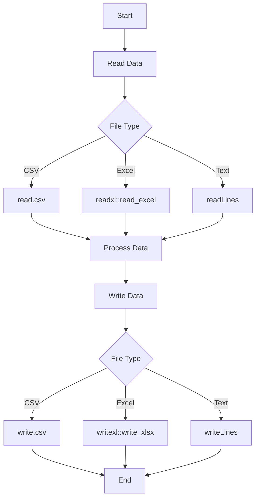
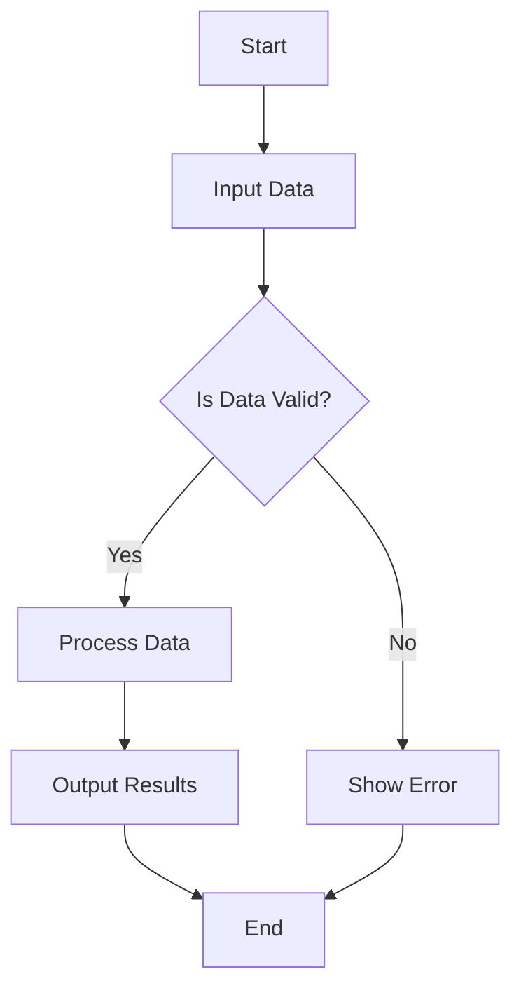
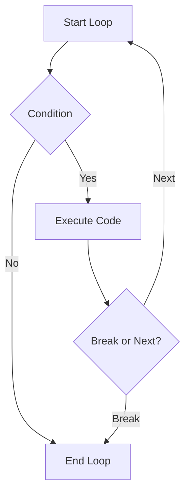
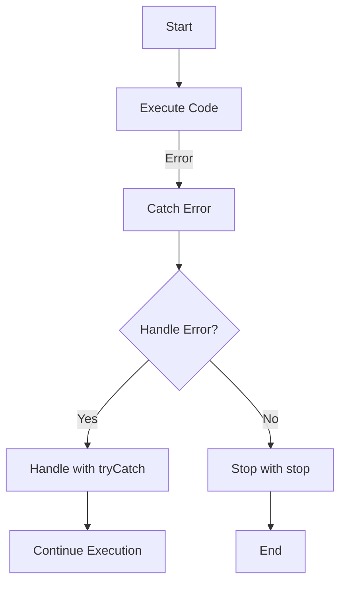
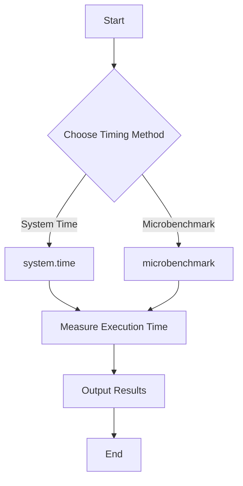
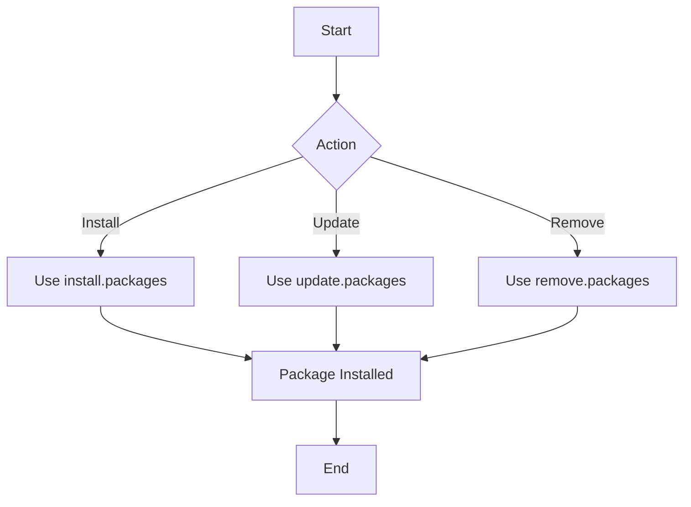

# R Programming - Unit 2

## 1. Reading and writing files in R


#### Reading and Writing Files in R

R provides functions to read and write various file types. Below is a breakdown of common file types and their corresponding functions.

##### CSV Files

- **Reading CSV**: Use `read.csv()`.
- **Writing CSV**: Use `write.csv()`.

```r
# Reading a CSV file
data <- read.csv("data.csv")

# Writing a CSV file
write.csv(data, "output.csv", row.names = FALSE)
```

##### Excel Files

- **Reading Excel**: Use `readxl::read_excel()`.
- **Writing Excel**: Use `writexl::write_xlsx()`.

```r
library(readxl)  # Install with install.packages("readxl")
library(writexl) # Install with install.packages("writexl")

# Reading an Excel file
data <- read_excel("data.xlsx")

# Writing an Excel file
write_xlsx(data, "output.xlsx")
```

##### Text Files

- **Reading Text**: Use `readLines()`.
- **Writing Text**: Use `writeLines()`.

```r
# Reading a text file
lines <- readLines("data.txt")

# Writing a text file
writeLines(lines, "output.txt")
```

##### Mermaid Flowchart



##### Complexity

- **Time Complexity**: \(O(n)\) for reading and writing, where \(n\) is the number of rows.
- **Space Complexity**: \(O(n)\) for storing data in memory.

<sub>This was AI generated from github copilot on 2025-12-23</sub>


## 2. Input and Output statements in R


#### R Programming: Input and Output

R is a programming language primarily used for statistical computing and graphics. It provides functions for reading and writing data, enabling users to interact with datasets efficiently.

##### Input and Output Statements

In R, the basic functions for input and output are `print()`, `cat()`, `read.table()`, and `write.table()`. Below are examples illustrating their use.

```r
# Output: Printing a message
print("Hello, R!")

# Output: Concatenating and printing multiple values
cat("The sum of 2 and 3 is:", 2 + 3, "\n")

# Input: Reading data from a CSV file
data <- read.table("data.csv", header=TRUE, sep=",")

# Output: Writing data to a CSV file
write.table(data, "output.csv", sep=",", row.names=FALSE)
```

##### Flowchart of Input and Output Process



##### Complexity

- Time Complexity: \(O(n)\) for reading/writing files, where \(n\) is the number of records.
- Space Complexity: \(O(n)\) for storing the data in memory.

<sub>This was AI generated from github copilot on 2025-12-23</sub>


## 3. Conditional statements in R


#### R Programming Overview

R is a programming language primarily used for statistical computing and data analysis. It provides a variety of tools for data manipulation, visualization, and modeling.

##### Conditional Statements in R

Conditional statements allow you to execute different code based on certain conditions. The primary syntax involves `if`, `else if`, and `else`.

Here’s a simple example demonstrating conditional statements in R:

```r
x <- 5

if (x > 0) {
  print("Positive number")
} else if (x < 0) {
  print("Negative number")
} else {
  print("Zero")
}
```

The above code checks if `x` is positive, negative, or zero and prints the corresponding message.

##### Mermaid Diagram

Below is a simple flowchart illustrating the flow of conditional statements in R:

```mermaid
flowchart TD
    A[Start] --> B{Is x > 0?}
    B -- Yes --> C[Print "Positive number"]
    B -- No --> D{Is x < 0?}
    D -- Yes --> E[Print "Negative number"]
    D -- No --> F[Print "Zero"]
    C --> G[End]
    E --> G
    F --> G
```

This diagram visually represents the flow of decisions based on the value of `x`.

<sub>This was AI generated from github copilot on 2025-12-23</sub>


## 4. Looping statements in R with differences, syntax and diagram


use-AI-here-please: "R Programming: generate a short, simple explanation. use mermaid features and latex if needed, put in code blocks if needed. Do not use headings larger than h3. If using code, write simple code that is easy to remember and visualize with minimal parameters: Looping statements in R with differences, syntax and diagram
 with a mermaid diagram with less than 4 to 7 elements and simple text but accurate bubble shapes"

## 5. Difference between break and next statements


#### R Programming Overview

R is a programming language primarily used for statistical computing and graphics. It provides a wide variety of statistical and graphical techniques and is highly extensible. R is widely used among statisticians and data miners for developing statistical software and data analysis.

#### Control Flow Statements: `break` vs `next`

In R, `break` and `next` are control flow statements used within loops to alter the flow of execution:

- **`break`**: Exits the loop entirely.
- **`next`**: Skips the current iteration and proceeds to the next iteration of the loop.

#### Comparison Table

| Statement | Purpose                       | Effect on Loop     |
|-----------|-------------------------------|---------------------|
| `break`   | Exit the loop                 | Ends the loop       |
| `next`    | Skip current iteration         | Continues to next iteration |

#### Example Code

```r
# Example using break and next in a loop
for (i in 1:5) {
  if (i == 3) {
    next  # Skip when i is 3
  }
  if (i == 5) {
    break  # Exit the loop when i is 5
  }
  print(i)
}
```

#### Flowchart of Control Flow



This flowchart illustrates the decision-making process in a loop regarding when to execute code, skip iterations, or break out of the loop.

<sub>This was AI generated from github copilot on 2025-12-23</sub>


## 6. Function and types of function 
- with syntax to define user defined function and an appropriate example
- Explain Inline function/lambda function with example


use-AI-here-please: "R Programming: generate a short, simple explanation. use mermaid features and latex if needed, put in code blocks if needed. Do not use headings larger than h3. If using code, write simple code that is easy to remember and visualize with minimal parameters: Function and types of function 
- with syntax to define user defined function and an appropriate example
- Explain Inline function/lambda function with example  with a mermaid diagram with less than 4 to 7 elements and simple text but accurate bubble shapes"


## 7. What are exceptions? Explain different types of statement to handle exception


#### Exceptions in R Programming

Exceptions in R are events that occur during the execution of a program that disrupt the normal flow of instructions. When an error occurs, R can handle it using specific statements to prevent the program from crashing. 

#### Types of Exception Handling Statements

1. **try()**: Executes an expression and catches any errors.
2. **tryCatch()**: Handles errors, warnings, and messages in a more controlled way.
3. **withCallingHandlers()**: Similar to `tryCatch()` but allows for more granular control over handlers.
4. **stop()**: Generates an error and stops execution.

#### Mermaid Diagram



#### Simple R Code Example

```r
# Example using tryCatch
result <- tryCatch({
  # Code that may cause an error
  log(-1)  # This will cause an error
}, error = function(e) {
  return("Error occurred: " + e$message)
})

print(result)
```

#### Time Complexity

The time complexity for handling exceptions is generally **O(1)** for the handling mechanism itself. However, the complexity of the code within the try block can vary based on its operations.

#### Space Complexity

The space complexity is also **O(1)** for storing the error state, with additional space depending on the size of the captured error message.

<sub>This was AI generated from github copilot on 2025-12-23</sub>


## 8. Timings and timing functions


#### R Programming: Timings and Timing Functions

In R, timing functions are used to measure the execution time of code. The primary functions for this purpose are `system.time()` and `microbenchmark()`. 

- **`system.time()`** measures the total time taken to evaluate an expression.
- **`microbenchmark()`** provides more precise timing for small code snippets.

Here’s a simple example using `system.time()`:

```R
# Example of using system.time
result <- system.time({
  # Simulating a task
  Sys.sleep(2)  # Sleep for 2 seconds
})
print(result)
```

#### Mermaid Diagram



### Time Complexity

The time complexity of these timing functions is generally constant, \(O(1)\), since they only measure the elapsed time of the executed code. 

### Space Complexity

The space complexity is also minimal, \(O(1)\), as it does not require additional space proportional to the input size.

<sub>This was AI generated from github copilot on 2025-12-23</sub>


## 9. What are packages? How to Install, Update and Remove Packages


#### R Packages Overview

In R, packages are collections of R functions, data, and documentation bundled together. They extend R's capabilities and provide additional functionalities for various tasks, such as data analysis, visualization, and statistical modeling.

#### Installing, Updating, and Removing Packages

You can manage R packages using the following functions:

- **Install a Package**: Use `install.packages("package_name")` to install a package from CRAN.
- **Update a Package**: Use `update.packages()` to update all installed packages to their latest versions.
- **Remove a Package**: Use `remove.packages("package_name")` to uninstall a package.

#### Example Code

```r
# Install a package
install.packages("ggplot2")  # Example package for data visualization

# Update all packages
update.packages()

# Remove a package
remove.packages("ggplot2")
```

#### Flowchart of Package Management



This flowchart illustrates the process of managing R packages through installation, updating, and removal.

<sub>This was AI generated from github copilot on 2025-12-23</sub>