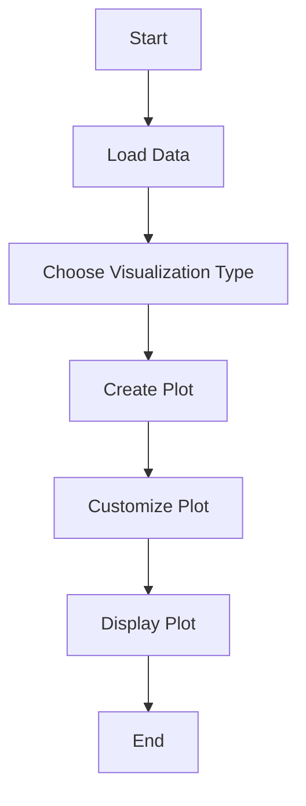
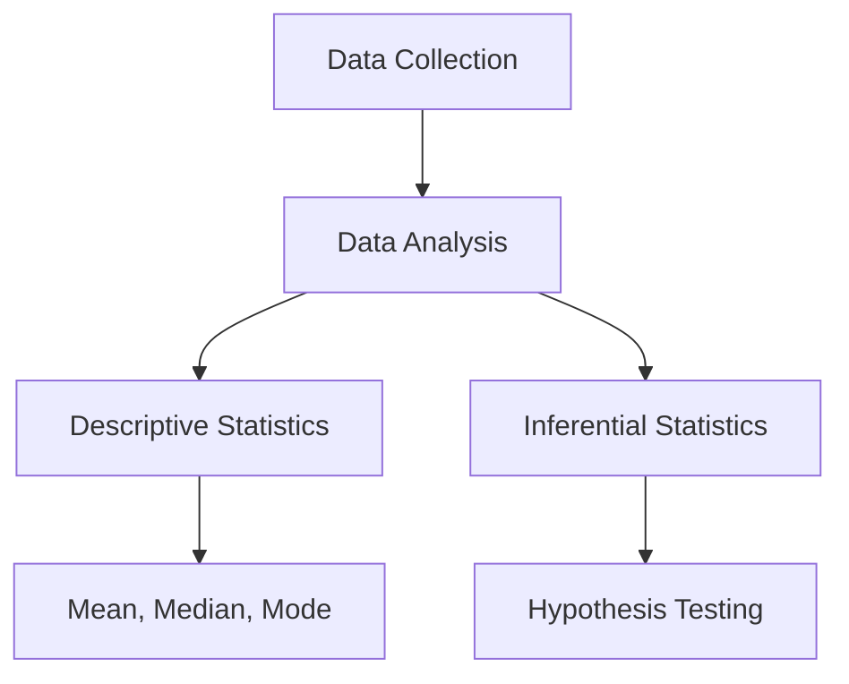
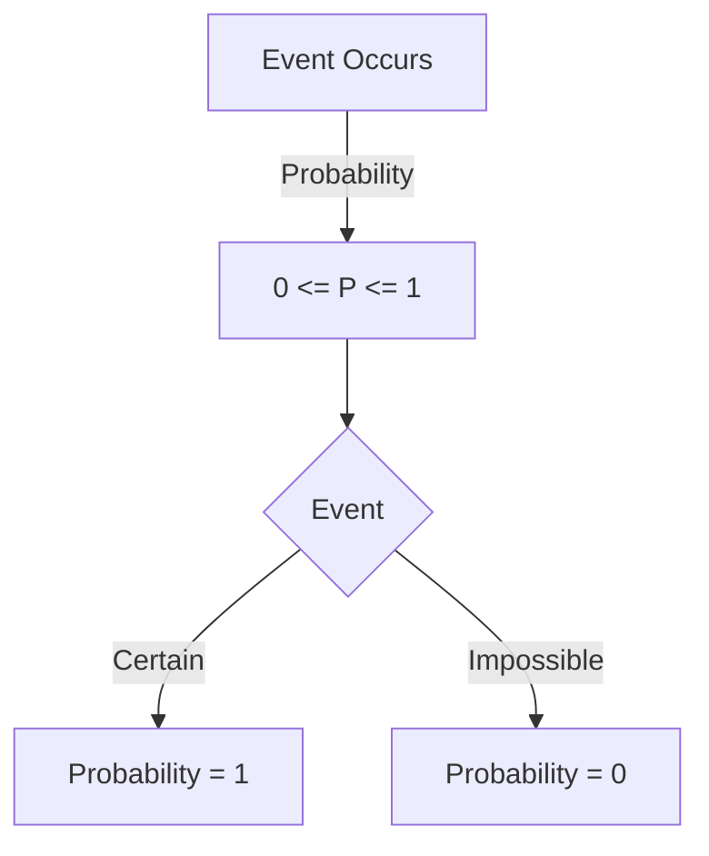
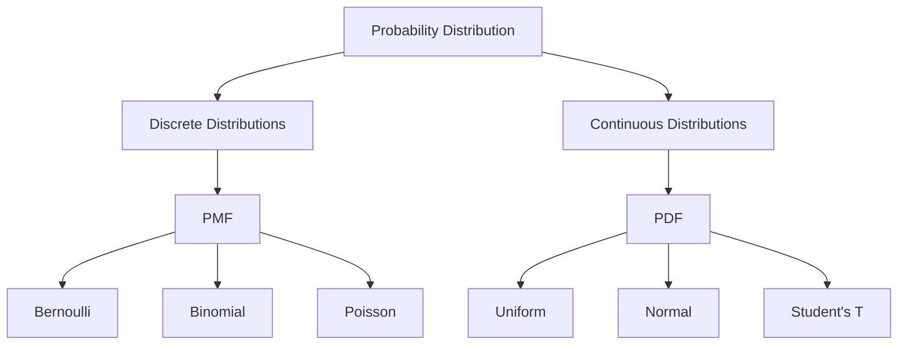

# R Programming - Unit 3
## 1. Basic data visualization concepts


#### R Programming: Basic Data Visualization Concepts

R is a powerful language for statistical computing and graphic visualization. The key libraries for data visualization in R include `ggplot2`, `lattice`, and base R plotting functions. The fundamental concept is to represent data in a graphical format to identify patterns, trends, and insights.

##### Key Concepts

1. **Data Frames**: R uses data frames to store data in a table format, where rows represent observations and columns represent variables.
2. **ggplot2**: A popular package for creating elegant visualizations using a grammar of graphics approach.
3. **Layers**: Visualizations can be built in layers, allowing for more customization.

##### Example Code

Here’s a simple example using `ggplot2` to create a scatter plot:

```R
# Load ggplot2 library
library(ggplot2)

# Create a simple data frame
data <- data.frame(
  x = c(1, 2, 3, 4, 5),
  y = c(2, 3, 5, 7, 11)
)

# Generate a scatter plot
ggplot(data, aes(x = x, y = y)) +
  geom_point() +
  labs(title = "Simple Scatter Plot", x = "X-axis", y = "Y-axis")
```

##### Complexity Analysis

The time complexity of generating a plot is generally \(O(n)\), where \(n\) is the number of data points being plotted. The space complexity is also \(O(n)\) due to storage of the data points during the plotting process.

```latex
\text{Time Complexity: } O(n) \\
\text{Space Complexity: } O(n)
```

##### Mermaid Diagram

Below is a simple flowchart to visualize the process of creating a plot in R:



This outlines the basic steps for data visualization in R, making it easier to remember the workflow.

<sub>This was AI generated from github copilot on 2025-12-23</sub>


## 2. What is statistics?


#### What is Statistics?

Statistics is the branch of mathematics that deals with collecting, analyzing, interpreting, presenting, and organizing data. It provides methodologies for making inferences or predictions about a population based on a sample.

##### Key Concepts of Statistics:
- **Descriptive Statistics**: Summarizes data using measures like mean, median, and mode.
- **Inferential Statistics**: Makes predictions or inferences about a population based on a sample.

##### Example of Descriptive Statistics in R

```r
# Sample data
data <- c(5, 7, 8, 6, 9)

# Calculate mean
mean_value <- mean(data)

# Calculate median
median_value <- median(data)

# Output results
mean_value  # Mean
median_value  # Median
```

##### Visualizing Data Flow with Mermaid



The above flowchart illustrates the process of statistics from data collection to analysis, highlighting the two branches: descriptive and inferential statistics.

<sub>This was AI generated from github copilot on 2025-12-23</sub>


## 3. What is probability?


#### Probability in R

Probability measures the likelihood of an event occurring, expressed as a value between 0 and 1, where 0 indicates impossibility and 1 indicates certainty. 

In R, probability can be calculated using various functions, such as `dbinom` for binomial probabilities or `pnorm` for normal probabilities. 

##### Simple Example in R

Here's a basic example of calculating the probability of getting heads in a coin flip:

```r
# Probability of heads in a coin flip
p_heads <- 0.5  # Probability of getting heads
n_flips <- 10   # Number of flips

# Probability of getting exactly 5 heads
prob_5_heads <- dbinom(5, n_flips, p_heads)
print(prob_5_heads)
```

##### Mermaid Diagram

Here’s a simple flowchart demonstrating the concept of probability:



##### Time and Space Complexity

If we consider calculating probabilities in a basic statistical sense, the time complexity is generally O(1) for simple calculations, and space complexity is also O(1). 

\[
\text{Time Complexity: } O(1), \quad \text{Space Complexity: } O(1)
\] 

This indicates that the calculations do not depend on the size of the input data.

<sub>This was AI generated from github copilot on 2025-12-23</sub>


## 4. Common probability distributions
- Explain what is probability distribution
- types of probability distribution
- What is PMF? Explain types of PMF.
- What is PDF? Explain types of PDF
- Binomial , Bernoulli , poisson, uniform uniform and students T distribution(with individual breakdowns with example)
- Compare PDF & PMF


#### Probability Distribution

A **probability distribution** describes how probabilities are distributed over the values of a random variable. It provides a function that assigns probabilities to each possible outcome.

#### Types of Probability Distributions

1. **Discrete Distributions**: Probability distributions for discrete random variables.
2. **Continuous Distributions**: Probability distributions for continuous random variables.

#### PMF (Probability Mass Function)

The **PMF** defines the probability of a discrete random variable taking specific values. 

**Types of PMF**:
- **Bernoulli Distribution**: Models a single trial with two outcomes (success/failure).
- **Binomial Distribution**: Models the number of successes in a fixed number of Bernoulli trials.
- **Poisson Distribution**: Models the number of events in a fixed interval of time/space.

**Example of PMF**: 

For a Bernoulli distribution:
```r
# Bernoulli PMF
p <- 0.5  # Probability of success
x <- 0:1  # Possible outcomes
pmf <- dbinom(x, size=1, prob=p)
pmf
```

#### PDF (Probability Density Function)

The **PDF** defines the probability of a continuous random variable falling within a particular range of values.

**Types of PDF**:
- **Uniform Distribution**: All outcomes are equally likely.
- **Normal Distribution**: Bell-shaped curve representing the distribution of many types of data.
- **Student's T Distribution**: Similar to the normal distribution, but with heavier tails.

**Example of PDF**:

For a Uniform distribution:
```r
# Uniform PDF
a <- 0  # Lower bound
b <- 1  # Upper bound
x <- seq(a, b, length.out = 100)
pdf <- dunif(x, min=a, max=b)
plot(x, pdf, type='l', main='Uniform Distribution PDF', ylab='Density', xlab='x')
```

#### Comparison of PMF & PDF

| Feature                  | PMF                          | PDF                          |
|--------------------------|------------------------------|------------------------------|
| Type                     | Discrete                     | Continuous                   |
| Definition               | Probability of discrete values| Probability density function  |
| Integral/Sum             | Sum of probabilities = 1     | Area under curve = 1         |
| Examples                 | Bernoulli, Binomial, Poisson| Uniform, Normal, Student's T |

#### Diagram with Mermaid



#### Mathematical Representation of PMF and PDF

- PMF for Binomial Distribution:
  
  \[
  P(X = k) = \binom{n}{k} p^k (1-p)^{n-k}
  \]

- PDF for Normal Distribution:

  \[
  f(x) = \frac{1}{\sqrt{2\pi\sigma^2}} e^{-\frac{(x - \mu)^2}{2\sigma^2}}
  \]

This summary provides a concise overview of probability distributions, PMF, and PDF, along with examples and comparisons.

<sub>This was AI generated from github copilot on 2025-12-23</sub>