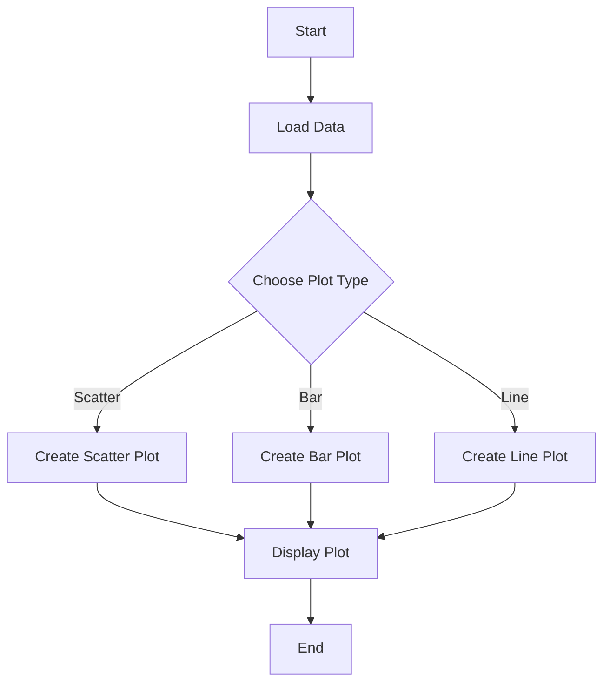
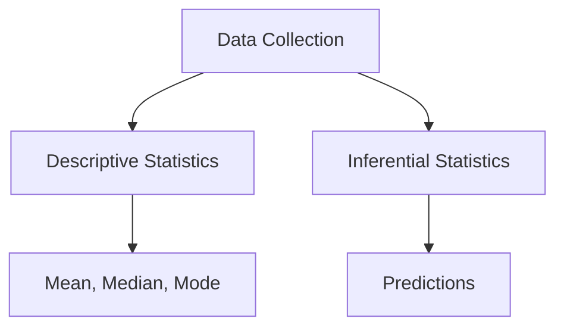
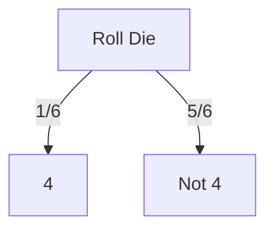
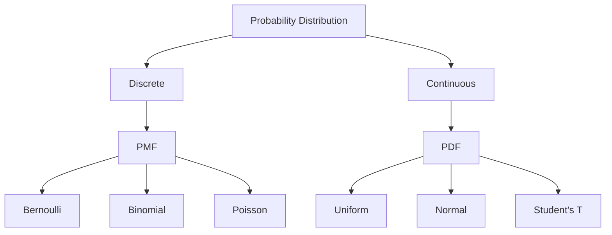

# R Programming - Unit 3
## 1. Basic data visualization concepts


#### R Programming: Basic Data Visualization Concepts

R is a powerful language for statistical computing and graphics. It provides various packages and functions for data visualization. The most commonly used library for this purpose is `ggplot2`, which follows the grammar of graphics principles.

##### Key Concepts:

1. **Data Frames**: The primary data structure in R, similar to tables in databases.
2. **Aesthetics**: Mapping data variables to visual properties (e.g., x and y axes, color, size).
3. **Geometries**: The visual elements (e.g., points, lines, bars) that represent data.

##### Simple Example Code:

```r
# Load ggplot2 library
library(ggplot2)

# Create a simple dataset
data <- data.frame(
  x = c(1, 2, 3, 4, 5),
  y = c(2, 3, 5, 7, 11)
)

# Basic scatter plot
ggplot(data, aes(x = x, y = y)) +
  geom_point() +
  labs(title = "Basic Scatter Plot", x = "X-axis", y = "Y-axis")
```

This code snippet generates a basic scatter plot using the `ggplot2` package. 

##### Visualization Flow Diagram:



##### Complexity Analysis:

The time complexity for generating a simple plot is generally \(O(n)\), where \(n\) is the number of data points. The space complexity is also \(O(n)\) for storing the data frame.

<sub>This was AI generated from github copilot on 2025-12-23</sub>


## 2. What is statistics?


#### What is Statistics?

Statistics is a branch of mathematics dealing with data collection, analysis, interpretation, presentation, and organization. It helps in understanding patterns and making informed decisions based on data.

##### Key Concepts in Statistics

1. **Descriptive Statistics**: Summarizes data through numbers (mean, median, mode) and visualizations (charts, graphs).
2. **Inferential Statistics**: Makes predictions or inferences about a population based on a sample.

##### Simple R Code Example

```r
# Sample data
data <- c(5, 10, 15, 20, 25)

# Descriptive statistics
mean_value <- mean(data)  # Mean
median_value <- median(data)  # Median
mode_value <- as.numeric(names(sort(table(data), decreasing=TRUE)[1]))  # Mode

# Results
cat("Mean:", mean_value, "\nMedian:", median_value, "\nMode:", mode_value)
```

##### Time and Space Complexity

- **Time Complexity**: 
  - Mean: \(O(n)\)
  - Median: \(O(n \log n)\) (if sorted)
  - Mode: \(O(n)\)

- **Space Complexity**: \(O(n)\) for storing the data.

##### Mermaid Flowchart



Statistics plays a crucial role in various fields, enabling data-driven insights and decision-making.

<sub>This was AI generated from github copilot on 2025-12-23</sub>


## 3. What is probability?


#### Probability in R

Probability is a measure of the likelihood that an event will occur. It ranges from 0 (impossible event) to 1 (certain event). In R, you can calculate and visualize probabilities using basic functions and libraries.

##### Basic Probability Calculation

Here’s a simple example of calculating the probability of rolling a specific number on a six-sided die:

```r
# Total outcomes
total_outcomes <- 6

# Favorable outcomes (rolling a 4)
favorable_outcomes <- 1

# Probability calculation
probability <- favorable_outcomes / total_outcomes
print(probability)
```

##### Visual Representation

You can visualize the probability distribution of rolling a die using a bar plot:

```r
# Load necessary library
library(ggplot2)

# Create a data frame for outcomes
outcomes <- data.frame(
  number = 1:6,
  probability = rep(1/6, 6)
)

# Plot
ggplot(outcomes, aes(x = factor(number), y = probability)) +
  geom_bar(stat = "identity") +
  labs(title = "Probability Distribution of a Six-Sided Die",
       x = "Die Number",
       y = "Probability")
```

##### Probability Tree Diagram

A probability tree can help visualize outcomes. Here’s a simple representation in Mermaid syntax:



This diagram shows the two possible outcomes when rolling a die, indicating the probabilities associated with each outcome.

<sub>This was AI generated from github copilot on 2025-12-23</sub>


## 4. Common probability distributions
- Explain what is probability distribution
- types of probability distribution
- What is PMF? Explain types of PMF.
- What is PDF? Explain types of PDF
- Binomial , Bernoulli , poisson, uniform uniform and students T distribution(with individual breakdowns with example)
- Compare PDF & PMF


#### Probability Distribution

A **probability distribution** describes how probabilities are distributed over the values of a random variable. It provides a function that maps outcomes to their associated probabilities.

#### Types of Probability Distributions

1. **Discrete Distributions**: Defined for discrete random variables (e.g., Binomial, Poisson).
2. **Continuous Distributions**: Defined for continuous random variables (e.g., Normal, Uniform).

#### What is PMF?

**PMF (Probability Mass Function)** gives the probability that a discrete random variable is exactly equal to some value. 

**Types of PMF**:
- **Bernoulli Distribution**: Represents two outcomes (success/failure).
- **Binomial Distribution**: Represents the number of successes in a fixed number of independent Bernoulli trials.
- **Poisson Distribution**: Represents the number of events in a fixed interval of time or space.

##### PMF Examples

- **Bernoulli Distribution**:
  - PMF: \( P(X = k) = p^k (1-p)^{1-k}, \, k \in \{0, 1\} \)

- **Binomial Distribution**:
  - PMF: \( P(X = k) = \binom{n}{k} p^k (1-p)^{n-k}, \, k = 0, 1, \ldots, n \)

- **Poisson Distribution**:
  - PMF: \( P(X = k) = \frac{\lambda^k e^{-\lambda}}{k!}, \, k = 0, 1, 2, \ldots \)

#### What is PDF?

**PDF (Probability Density Function)** describes the likelihood of a continuous random variable taking on a specific value.

**Types of PDF**:
- **Uniform Distribution**: All outcomes are equally likely.
- **Normal Distribution**: Bell-shaped curve, defined by mean and standard deviation.
- **Student's T Distribution**: Similar to normal but with heavier tails, useful for smaller sample sizes.

##### PDF Examples

- **Uniform Distribution**:
  - PDF: \( f(x) = \frac{1}{b-a} \, \text{for} \, a \leq x \leq b \)

- **Normal Distribution**:
  - PDF: \( f(x) = \frac{1}{\sqrt{2\pi\sigma^2}} e^{-\frac{(x - \mu)^2}{2\sigma^2}} \)

- **Student's T Distribution**:
  - PDF: \( f(x) = \frac{\Gamma(\frac{v+1}{2})}{\sqrt{v\pi} \Gamma(\frac{v}{2})} \left(1 + \frac{x^2}{v}\right)^{-\frac{v+1}{2}} \)

#### Compare PDF & PMF

| Feature               | PMF                                      | PDF                                      |
|-----------------------|------------------------------------------|------------------------------------------|
| Definition            | Probability of discrete outcomes         | Density of continuous outcomes           |
| Type                  | Discrete                                 | Continuous                               |
| Integral/Sum          | Sum of probabilities equals 1           | Area under the curve equals 1           |
| Example               | Binomial, Poisson                        | Normal, Uniform                          |



#### Simple R Code Example

```r
# R code for Binomial PMF
n <- 10  # number of trials
p <- 0.5 # probability of success
k <- 0:n # number of successes

# PMF for Binomial Distribution
pmf_binomial <- dbinom(k, n, p)
print(pmf_binomial)
```

#### Complexity

- **Time Complexity**: \(O(n)\) for computing probabilities.
- **Space Complexity**: \(O(n)\) for storing outcomes.

<sub>This was AI generated from github copilot on 2025-12-23</sub>