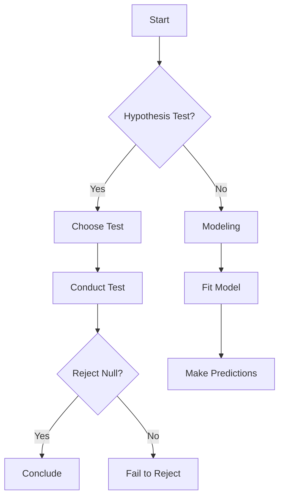
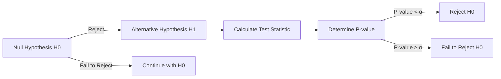
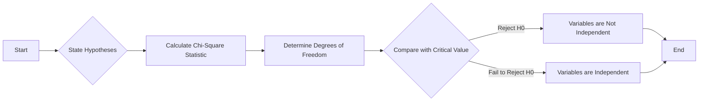
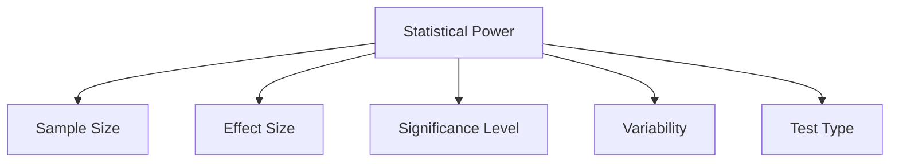
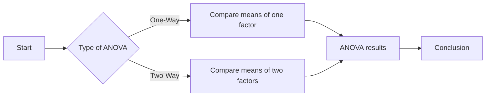

# R Programming - Unit 4
## 1. Write a note on statistical testing and modelling.
- Statistical model & steps to create statistical model
- Sampling distribution and type of sampling distribution
- Explain is sampling distribution of mean
- Explain sampling distribution of proportion
- Explain T distribution
- Testing mean
- Testing proportion
- Testing categorical variable & common statistical test used to analyse categorical
variable


#### R Programming Overview

R is a programming language and environment primarily used for statistical computing and data analysis. It provides a wide variety of statistical and graphical techniques, and is highly extensible.

##### Key Features:
- **Data Analysis**: R is designed for data manipulation, calculation, and graphical display.
- **Statistical Modeling**: Supports linear and nonlinear modeling, time-series analysis, and clustering.
- **Visualization**: Excellent for creating high-quality plots and charts.

##### Simple R Code Example

```r
# Simple linear regression example
data(mtcars)  # Load example dataset
model <- lm(mpg ~ wt, data = mtcars)  # Fit linear model
summary(model)  # Display model summary
```

##### Statistical Testing and Modeling

Statistical testing involves using data to determine if there is enough evidence to support a specific hypothesis. Common tests include t-tests, chi-square tests, and ANOVA. 

Modeling, on the other hand, involves creating a mathematical representation of data. It can be used for prediction or to understand relationships between variables.

##### Mermaid Flowchart for Statistical Testing



##### Time Complexity of Common Tests

- **t-test**: $O(n)$
- **ANOVA**: $O(nk)$ where $k$ is the number of groups

##### Space Complexity

- **All Tests**: $O(1)$ for constant space, except for storing input data.

This concise overview covers R programming, statistical testing, and modeling, providing a foundational understanding for further exploration.

<sub>This was AI generated from github copilot on 2025-12-23</sub>


## 2. Hypothesis testing & components of hypothesis testing


#### Hypothesis Testing in R

Hypothesis testing is a statistical method used to make inferences about population parameters based on sample data. It involves formulating two competing hypotheses: the null hypothesis (H0) and the alternative hypothesis (H1).

##### Components of Hypothesis Testing:

1. **Null Hypothesis (H0)**: A statement that there is no effect or no difference.
2. **Alternative Hypothesis (H1)**: A statement that contradicts the null hypothesis.
3. **Significance Level (α)**: The probability of rejecting the null hypothesis when it is true, commonly set at 0.05.
4. **Test Statistic**: A standardized value used to determine whether to reject H0.
5. **P-value**: The probability of obtaining test results at least as extreme as the observed results, given that H0 is true.
6. **Decision Rule**: A method to decide whether to reject or fail to reject H0 based on the p-value and α.

##### Simple R Code Example:

Here’s a basic example of a t-test in R:

```r
# Sample data
data1 <- c(5, 6, 7, 8, 9)
data2 <- c(6, 7, 8, 9, 10)

# Perform t-test
result <- t.test(data1, data2)

# Display result
print(result)
```

##### Visual Representation:



##### Complexity:

- **Time Complexity**: O(n) for the calculation of the test statistic.
- **Space Complexity**: O(1) since only a fixed amount of additional space is used.

This summarizes the key aspects of hypothesis testing in R.

<sub>This was AI generated from github copilot on 2025-12-23</sub>


## 3. Chi square test of independence & implementation of chi squared test of independence in R


#### Chi-Square Test of Independence

The Chi-Square Test of Independence is a statistical method used to determine whether there is a significant association between two categorical variables. It compares the observed frequencies in each category of a contingency table with the expected frequencies if the variables were independent.

##### Steps to Perform Chi-Square Test

1. **State Hypotheses**:
   - Null Hypothesis ($H_0$): Variables are independent.
   - Alternative Hypothesis ($H_a$): Variables are not independent.

2. **Calculate Chi-Square Statistic**:
   $$
   \chi^2 = \sum \frac{(O_i - E_i)^2}{E_i}
   $$
   where $O_i$ is the observed frequency and $E_i$ is the expected frequency.

3. **Determine Degrees of Freedom**:
   $$
   df = (r - 1)(c - 1)
   $$
   where $r$ is the number of rows and $c$ is the number of columns.

4. **Compare with Critical Value**:
   Using the Chi-Square distribution table, compare the calculated statistic with the critical value at desired significance level (e.g., 0.05).

##### Implementation in R

Here’s a simple R code snippet to perform the Chi-Square Test of Independence:

```r
# Create a contingency table
data <- matrix(c(10, 20, 30, 40), nrow = 2)

# Perform Chi-Square Test
result <- chisq.test(data)

# Print the result
print(result)
```

##### Mermaid Diagram

Below is a flowchart illustrating the steps involved in conducting the Chi-Square Test of Independence:



This diagram outlines the sequential steps from hypothesis formulation to conclusion.

<sub>This was AI generated from github copilot on 2025-12-23</sub>


## 4. What is statistical power? What are the key factors affecting statistical power


#### What is Statistical Power?

Statistical power is the probability that a statistical test will correctly reject a false null hypothesis (i.e., detect an effect when there is one). It is a crucial concept in hypothesis testing as it helps to determine the likelihood of avoiding a Type II error (failing to detect an effect).

The power of a test can be expressed as:

$$
\text{Power} = 1 - \beta
$$

where $\beta$ is the probability of a Type II error.

#### Key Factors Affecting Statistical Power

1. **Sample Size (n)**: Larger sample sizes generally increase power because they provide more information about the population.

2. **Effect Size**: The larger the true effect (the difference between groups), the more power the test has to detect it.

3. **Significance Level (α)**: A higher alpha level (e.g., 0.05 vs. 0.01) increases power, as it makes it easier to reject the null hypothesis.

4. **Variability**: Lower variability or noise in the data increases power because it makes true effects easier to detect.

5. **Test Type**: One-tailed tests typically have more power than two-tailed tests when the effect is in the predicted direction.

#### Visualization of Factors Affecting Power



This diagram illustrates the primary factors that influence the statistical power of a test. Understanding these factors can help researchers design more effective studies.

<sub>This was AI generated from github copilot on 2025-12-23</sub>


## 5. Explain ANOVA
- Types of ANOVA
- R implementation of 
    - one way ANOVA
    - two way ANOVA


#### ANOVA Overview

ANOVA (Analysis of Variance) is a statistical method used to compare means between two or more groups to determine if at least one group mean is significantly different from the others. 

#### Types of ANOVA

1. **One-Way ANOVA**: Tests differences between the means of three or more independent (unrelated) groups based on one factor.
2. **Two-Way ANOVA**: Tests differences between means based on two factors, which can include interaction effects between the factors.

#### R Implementation

```r
# One-Way ANOVA
one_way_anova <- aov(response ~ factor, data = dataset)
summary(one_way_anova)

# Two-Way ANOVA
two_way_anova <- aov(response ~ factor1 * factor2, data = dataset)
summary(two_way_anova)
```

#### Mermaid Representation



#### Complexity

- **One-Way ANOVA**: 
  - Time Complexity: $O(n)$
  - Space Complexity: $O(1)$

- **Two-Way ANOVA**:
  - Time Complexity: $O(n \cdot m)$ where $m$ is the number of levels of the second factor.
  - Space Complexity: $O(1)$ 

This concise explanation covers the essential aspects of ANOVA, its types, R implementations, and a simple flowchart representation.

<sub>This was AI generated from github copilot on 2025-12-23</sub>