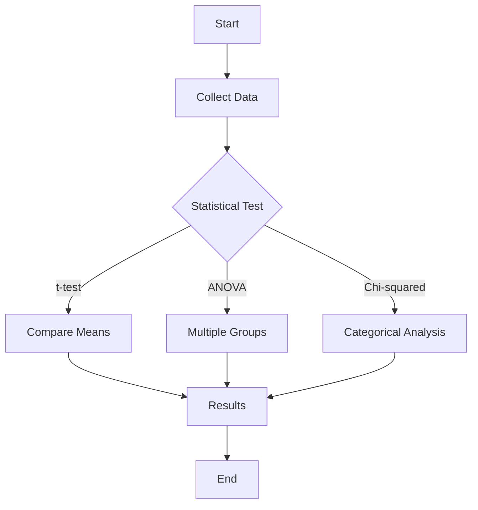
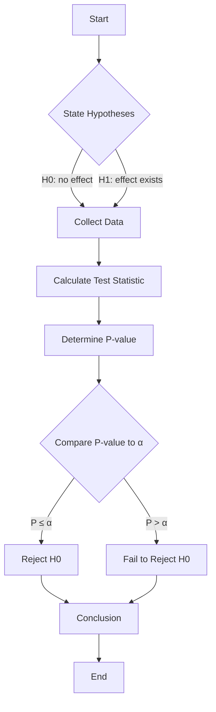
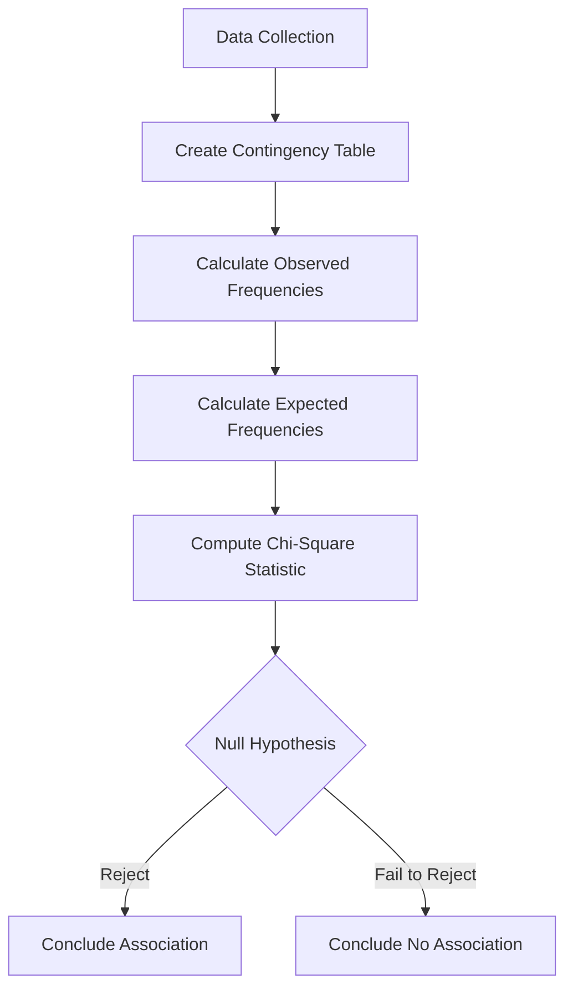
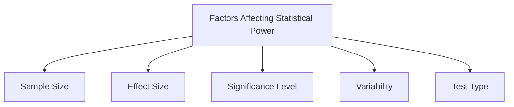
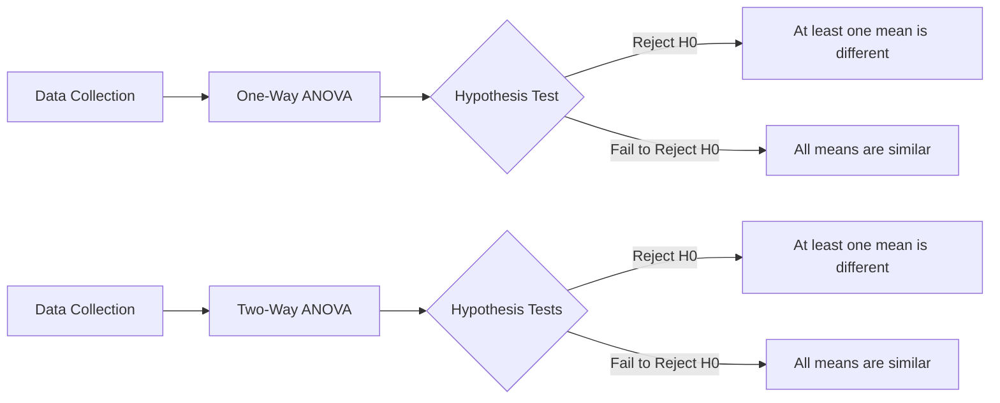

# R Programming - Unit 4
## 1. Write a note on statistical testing and modelling.
- Statistical model & steps to create statistical model
- Sampling distribution and type of sampling distribution
- Explain is sampling distribution of mean
- Explain sampling distribution of proportion
- Explain T distribution
- Testing mean
- Testing proportion
- Testing categorical variable & common statistical test used to analyse categorical
variable


#### R Programming Overview

R is a programming language and environment specifically designed for statistical computing and data analysis. It provides a wide array of statistical tests and modeling techniques, enabling users to perform complex analyses efficiently.

#### Statistical Testing

Statistical testing is a method used to determine whether there is enough evidence in a sample of data to infer that a certain condition holds for the entire population. Common tests include:

- **t-test**: Compares means between two groups.
- **Chi-squared test**: Assesses relationships between categorical variables.
- **ANOVA**: Compares means across multiple groups.

Here’s a simple example of a t-test in R:

```r
# Sample data
group1 <- c(5, 6, 7, 8, 9)
group2 <- c(4, 5, 6, 7, 8)

# Perform t-test
result <- t.test(group1, group2)
print(result)
```

#### Modeling

Statistical modeling in R often involves fitting a model to data to make predictions or understand relationships. A common approach is linear regression.

Example of a simple linear regression model:

```r
# Sample data
x <- c(1, 2, 3, 4, 5)
y <- c(2, 3, 5, 7, 11)

# Fit linear model
model <- lm(y ~ x)
summary(model)
```

#### Mermaid Flowchart of Statistical Process



### Complexity

For the t-test and linear regression, the time complexity is generally \( O(n) \), where \( n \) is the number of observations. The space complexity is also \( O(n) \) due to the data storage.

This concise overview summarizes R's capabilities in statistical testing and modeling, making it a powerful tool for data analysis.

<sub>This was AI generated from github copilot on 2025-12-23</sub>


## 2. Hypothesis testing & components of hypothesis testing


#### R Programming: Hypothesis Testing

Hypothesis testing in R involves making inferences about a population based on sample data. It typically consists of:

1. **Null Hypothesis (H0)**: A statement asserting no effect or no difference.
2. **Alternative Hypothesis (H1)**: A statement indicating the presence of an effect or difference.
3. **Test Statistic**: A standardized value used to determine whether to reject H0.
4. **P-value**: The probability of observing data as extreme as the sample, given that H0 is true.
5. **Significance Level (α)**: A threshold (commonly 0.05) for deciding whether to reject H0.

##### Example Code in R

Here's a simple example using a t-test:

```r
# Sample data
data <- c(2.3, 2.5, 2.7, 3.1, 3.3)

# Hypothesis test
t_test_result <- t.test(data, mu = 3)

# Output results
print(t_test_result)
```

##### Mermaid Flowchart

The process of hypothesis testing can be visualized as follows:



##### Time and Space Complexity

For a t-test, the time complexity is generally \( O(n) \) where \( n \) is the number of observations, and the space complexity is \( O(1) \) as it does not require additional space proportional to the input size.

<sub>This was AI generated from github copilot on 2025-12-23</sub>


## 3. Chi square test of independence & implementation of chi squared test of independence in R


#### Chi-Square Test of Independence

The Chi-Square test of independence is a statistical method used to determine if there is a significant association between two categorical variables. It compares the observed frequencies in each category of a contingency table to the frequencies expected if the variables were independent.

##### Key Concepts

1. **Null Hypothesis (\(H_0\))**: Assumes no association between the variables.
2. **Alternative Hypothesis (\(H_a\))**: Assumes there is an association between the variables.
3. **Chi-Square Statistic**: Calculated as:

   \[
   \chi^2 = \sum \frac{(O - E)^2}{E}
   \]

   where \(O\) is the observed frequency, and \(E\) is the expected frequency.

##### Implementation in R

Here is a simple implementation of the Chi-Square test of independence in R:

```r
# Creating a contingency table
data <- matrix(c(10, 20, 20, 30), nrow = 2)

# Performing the Chi-Square test
chi_square_result <- chisq.test(data)

# Displaying the result
print(chi_square_result)
```

##### Mermaid Diagram

The following diagram illustrates the flow of the Chi-Square test process:



This flowchart provides a visual representation of the steps involved in conducting a Chi-Square test of independence.

<sub>This was AI generated from github copilot on 2025-12-23</sub>


## 4. What is statistical power? What are the key factors affecting statistical power


#### What is Statistical Power?

Statistical power is the probability of correctly rejecting the null hypothesis when it is false. It reflects the ability of a test to detect an effect if there is one. Higher power means a greater likelihood of identifying true effects.

#### Key Factors Affecting Statistical Power

1. **Sample Size (n)**: Larger sample sizes increase power.
2. **Effect Size**: Larger effects are easier to detect, increasing power.
3. **Significance Level (α)**: A higher alpha level (e.g., 0.10 vs. 0.05) increases power.
4. **Variability**: Lower variability in data leads to higher power.
5. **Test Type**: One-tailed tests have more power than two-tailed tests for the same sample size.

#### Diagram of Power Factors



#### Example Code in R

```r
# Load necessary library
library(pwr)

# Calculate power for a t-test
result <- pwr.t.test(d = 0.5, n = 30, sig.level = 0.05, type = "two.sample")
print(result)
```

This R code uses the `pwr` package to calculate the power of a two-sample t-test with a specified effect size, sample size, and significance level.

<sub>This was AI generated from github copilot on 2025-12-23</sub>


## 5. Explain ANOVA
- Types of ANOVA
- R implementation of 
    - one way ANOVA
    - two way ANOVA


#### ANOVA Overview

ANOVA (Analysis of Variance) is a statistical method used to compare means among three or more groups to determine if at least one group mean is significantly different from the others. 

#### Types of ANOVA

1. **One-Way ANOVA**: Compares means of three or more independent groups based on one independent variable.
2. **Two-Way ANOVA**: Compares means based on two independent variables and can assess interaction effects.

#### R Implementation

##### One-Way ANOVA

```r
# Sample data
data <- data.frame(
  group = rep(c("A", "B", "C"), each = 10),
  values = c(rnorm(10, mean = 5), rnorm(10, mean = 6), rnorm(10, mean = 7))
)

# One-Way ANOVA
result_oneway <- aov(values ~ group, data = data)
summary(result_oneway)
```

##### Two-Way ANOVA

```r
# Sample data
data2 <- data.frame(
  group1 = rep(c("A", "B"), each = 10),
  group2 = rep(c("X", "Y"), times = 10),
  values = rnorm(20)
)

# Two-Way ANOVA
result_twoway <- aov(values ~ group1 * group2, data = data2)
summary(result_twoway)
```

#### Mermaid Representation



#### Complexity Analysis

- **One-Way ANOVA**: 
  - Time Complexity: \(O(n)\)
  - Space Complexity: \(O(k)\)

- **Two-Way ANOVA**: 
  - Time Complexity: \(O(n)\)
  - Space Complexity: \(O(k \cdot m)\)

Where \(n\) is the total number of observations, \(k\) is the number of groups in one factor, and \(m\) is the number of groups in the second factor.

<sub>This was AI generated from github copilot on 2025-12-23</sub>