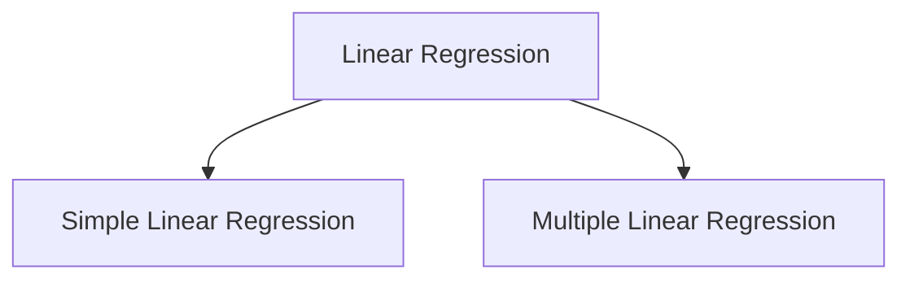
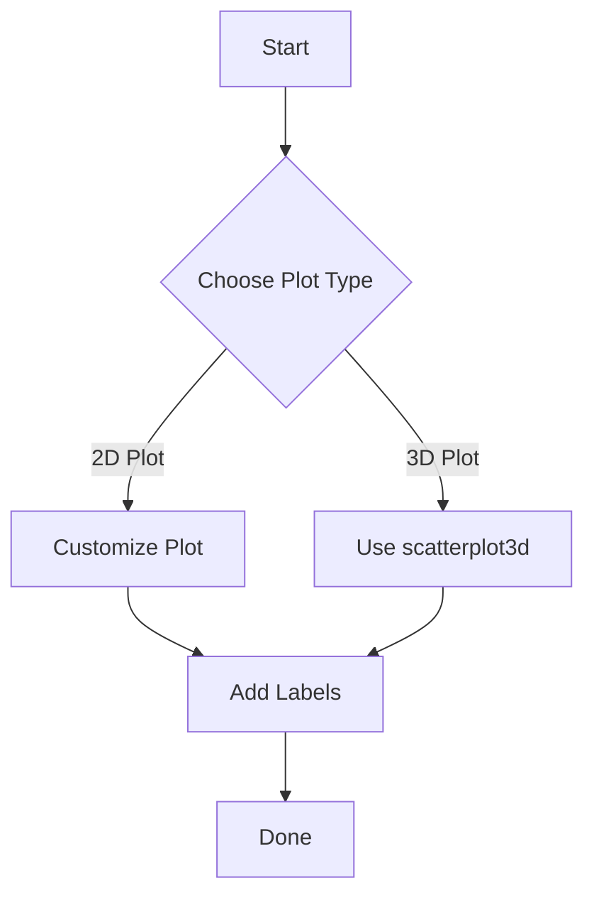

# R Programming - Unit 5
## 1. Linear regression
- types of linear regression
- R implementation of 
    - simple linear regression
    - multiple linear regression


#### Linear Regression

Linear regression is a statistical method used to model the relationship between a dependent variable and one or more independent variables. The goal is to find a linear equation that best predicts the dependent variable.

#### Types of Linear Regression

1. **Simple Linear Regression**: Involves one dependent variable and one independent variable. The relationship is modeled with a straight line.
2. **Multiple Linear Regression**: Involves one dependent variable and two or more independent variables. The relationship is modeled with a hyperplane in multi-dimensional space.

#### R Implementation

##### Simple Linear Regression

```R
# Sample data
x <- c(1, 2, 3, 4, 5)
y <- c(2, 3, 5, 7, 11)

# Fit the model
model_simple <- lm(y ~ x)

# Summary of the model
summary(model_simple)
```

##### Multiple Linear Regression

```R
# Sample data
x1 <- c(1, 2, 3, 4, 5)
x2 <- c(2, 3, 4, 5, 6)
y <- c(3, 5, 7, 9, 11)

# Fit the model
model_multiple <- lm(y ~ x1 + x2)

# Summary of the model
summary(model_multiple)
```

#### Diagram of Linear Regression Types



#### Complexity

- **Time Complexity**: \(O(n)\), where \(n\) is the number of data points.
- **Space Complexity**: \(O(1)\) for simple linear regression; \(O(p)\) for multiple linear regression, where \(p\) is the number of predictors.

<sub>This was AI generated from github copilot on 2025-12-23</sub>


## 2. Plot customization
- Point and click coordinate interaction
- Specialized test and labels
- 3D scatter plot
- Different ways to define colour for plots


#### R Programming Overview

R is a programming language and software environment primarily used for statistical computing and graphics. It allows users to perform data analysis, statistical modeling, and visualization with extensive libraries and packages.

##### Basic Plot Customization

R offers functions for customizing plots, including titles, labels, and colors.

```r
# Basic plot with customization
x <- 1:10
y <- x^2
plot(x, y, main="Quadratic Plot", xlab="X-Axis", ylab="Y-Axis", col="blue", pch=19)
```

##### Point and Click Coordinate Interaction

You can interact with plots using the `identify()` function to click on points and get their coordinates.

```r
# Identify points by clicking
plot(x, y)
identify(x, y)
```

##### Specialized Tests and Labels

You can add text annotations to specific points using `text()`.

```r
# Add labels to points
plot(x, y)
text(x, y, labels=letters[1:10], pos=3)
```

##### 3D Scatter Plot

For 3D plots, use the `scatterplot3d` package.

```r
# 3D scatter plot
library(scatterplot3d)
z <- rnorm(10)
scatterplot3d(x, y, z, main="3D Scatter Plot", color="red")
```

##### Different Ways to Define Color

Colors can be defined in several ways, including named colors, RGB values, or hexadecimal codes.

```r
# Different ways to define color
plot(x, y, col="blue")                 # Named color
plot(x, y, col=rgb(1, 0, 0))           # RGB values
plot(x, y, col="#FF5733")               # Hexadecimal color
```

#### Visualization with Mermaid

Below is a simple flowchart to visualize the process of plotting in R:



#### Complexity Analysis

For a basic plot function, the time complexity is \( O(n) \) where \( n \) is the number of points, and the space complexity is also \( O(n) \) due to storing point data.

This concise overview should help you understand the basics of plotting in R.

<sub>This was AI generated from github copilot on 2025-12-23</sub>