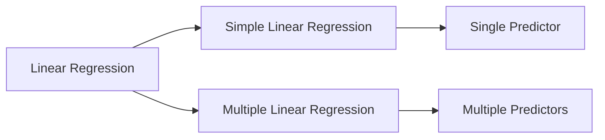
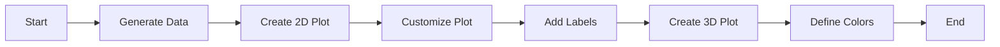

# R Programming - Unit 5
## 1. Linear regression
- types of linear regression
- R implementation of 
    - simple linear regression
    - multiple linear regression


#### Linear Regression

Linear regression is a statistical method used to model the relationship between a dependent variable and one or more independent variables. It aims to find a linear equation that best predicts the dependent variable based on the independent variables.

##### Types of Linear Regression

1. **Simple Linear Regression**: Involves one independent variable and one dependent variable. The model is represented as:
   $$
   Y = \beta_0 + \beta_1 X + \epsilon
   $$
   
2. **Multiple Linear Regression**: Involves multiple independent variables. The model is represented as:
   $$
   Y = \beta_0 + \beta_1 X_1 + \beta_2 X_2 + \ldots + \beta_n X_n + \epsilon
   $$

##### R Implementation

```r
# Simple Linear Regression
# Load necessary library
data(mtcars)

# Fit the model
simple_model <- lm(mpg ~ wt, data = mtcars)
summary(simple_model)

# Multiple Linear Regression
# Fit the model with multiple predictors
multiple_model <- lm(mpg ~ wt + hp + qsec, data = mtcars)
summary(multiple_model)
```



##### Complexity

- **Time Complexity**: $O(n^2)$ for the normal equation solution.
- **Space Complexity**: $O(n)$ for storing data points.

<sub>This was AI generated from github copilot on 2025-12-23</sub>


## 2. Plot customization
- Point and click coordinate interaction
- Specialized test and labels
- 3D scatter plot
- Different ways to define colour for plots


#### R Programming Overview

R is a programming language and environment primarily used for statistical computing and data visualization. It offers a variety of packages and tools to create complex plots and analyze data efficiently.

##### Basic Plot Customization

You can customize plots using the `plot()` function. Here is an example of a simple scatter plot with customized labels and colors:

```r
# Simple scatter plot with customization
x <- rnorm(100)  # Generate random normal data for x
y <- rnorm(100)  # Generate random normal data for y

plot(x, y, 
     main = "Customized Scatter Plot", 
     xlab = "X-axis Label", 
     ylab = "Y-axis Label", 
     col = "blue",        # Point color
     pch = 16)           # Point shape
```

##### Point and Click Coordinate Interaction

Using the `identify()` function, you can interactively identify points on a plot:

```r
# Identify points
plot(x, y)
identify(x, y)
```

##### Specialized Test and Labels

You can add text labels to specific points using the `text()` function:

```r
# Add labels to points
plot(x, y)
text(x[1:5], y[1:5], labels = paste("Point", 1:5), pos = 4)
```

##### 3D Scatter Plot

For 3D plotting, use the `plot3D` package. Here’s an example:

```r
# 3D Scatter plot
library(plot3D)
x <- rnorm(100)
y <- rnorm(100)
z <- rnorm(100)

scatter3D(x, y, z, col = "red", pch = 19, main = "3D Scatter Plot")
```

##### Different Ways to Define Color for Plots

Colors can be defined using names, hexadecimal codes, or RGB values. Here are examples:

```r
# Different color definitions
plot(x, y, col = "green")          # Color name
plot(x, y, col = "#FF5733")        # Hexadecimal
plot(x, y, col = rgb(0.1, 0.5, 0.8)) # RGB values
```

##### Mermaid Flowchart Example

A flowchart representing the workflow of plotting in R might look like this:



This overview provides a concise introduction to R programming with a focus on plotting customization and interactivity.

<sub>This was AI generated from github copilot on 2025-12-23</sub>